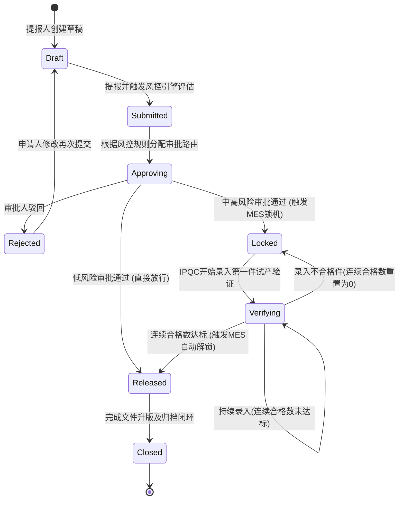
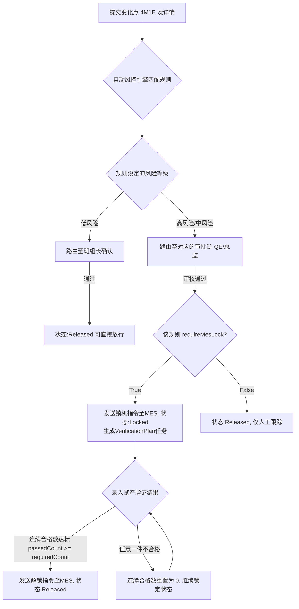
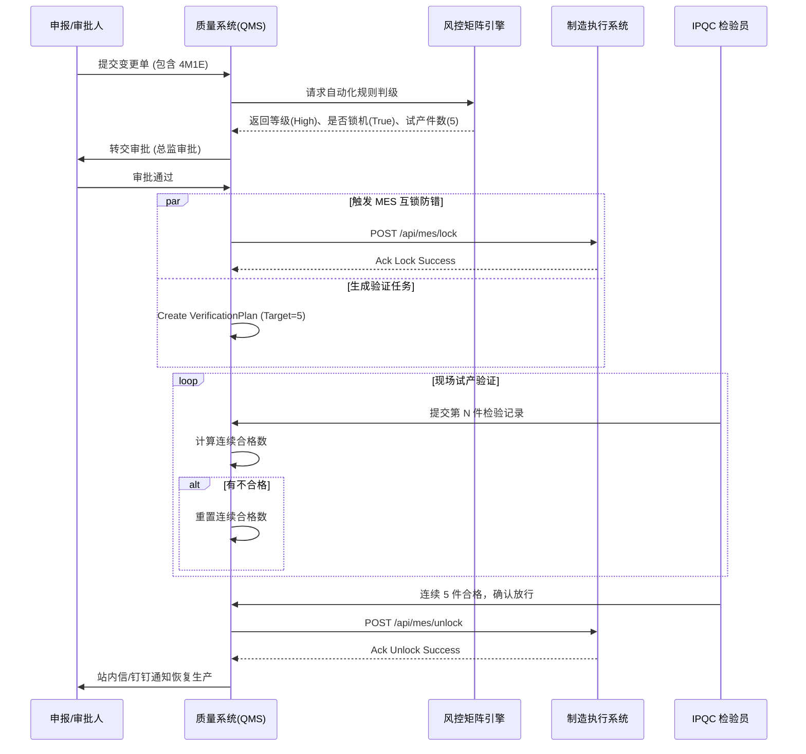

# 文档控制信息
- 文档编号：QMS-TDD-CPR-1.0
- 文档标题：变化点管理（Change Point Management）详细设计文档
- 版本：1.0
- 状态：已批准
- 编制日期：2026-03-06
- 依赖标准：IATF 16949:2016 §8.5.6 更改控制

---

## 1. 模块概述 (Module Overview)

### 1.1 背景与目标
在传统制造尤其是压铸、注塑等高重复性工序中，4M1E（人员、机器、物料、方法、环境及测量）的变化往往是导致质量事故的主要根因。传统方式依赖纸质单据审批，存在信息滞后、**缺乏物理拦截机制**的问题。经常出现变化发生且尚未经过首件/试生产验证，机台就已恢复批量报工，最终产生大批量废品。

本模块的核心价值在于**构建防错屏障**。通过对变化点进行标准化结构归集，利用自动化风控引擎进行实时定级；针对中高风险的变化点，在审批通过瞬间即调用外部 MES 系统锁定机台，拦截批量报工。直到在「验证中心」连续多件产品的检验均为合格后，系统才自动发送解锁指令，实现从**事后处理到事前拦截**的飞跃。

### 1.2 模块范围
| 端 | 功能 |
|---|---|
| **PC 端（展现层）** | 变化点中央看板、申报工作台与台账、风险矩阵规则配置、验证配置中心。 |
| **移动端/PDA** | （二期建设）现场扫码快速申报、扫码录入验证明细记录。 |
| **系统集成** | 对接下游 MES 系统的机台锁死/放行 API (`LockMachine`, `UnlockMachine`)；对接钉钉/企业微信实现超时与盲动预警推送。 |

---

## 2. 核心业务流程 (Core Business Flows)

### 2.1 全流程状态机

系统对基于 `ChangePointStatus` 进行严格的生命周期管控。



### 2.2 核心流转规则



### 2.3 系统交互与时序



---

## 3. 数据模型设计 (Data Model Design)

### 3.1 变化点主台账 (`cp_record`)
变化点台账记录所有流转状态的核心大表。

| 字段名 | 类型 | 必填 | 默认值 | 描述 |
|---|---|---|---|---|
| `id` | VARCHAR(36) | Y | | 内部主键 (PK) |
| `record_no` | VARCHAR(32) | Y | | 业务单号，如 `CPR-20240305-001` (唯一索引) |
| `title` | VARCHAR(128) | Y | | 单据标题 |
| `status` | VARCHAR(20) | Y | `'draft'` | 状态，枚举：`draft`, `submitted`, `approving`, `approved`, `locked`, `verifying`, `released`, `rejected`, `closed` |
| `risk_level` | VARCHAR(10) | Y | | 根据风控引擎评定的风险等级：`low`, `medium`, `high` |
| `change_type` | VARCHAR(20) | Y | | `man`, `machine`, `material`, `method`, `environment`, `measure`, `other` |
| `change_sub_type` | VARCHAR(64) | N | | 具体的子场景分类 |
| `change_description` | TEXT | N | | 内容详情及关键词命中源 |
| `mes_lock_time` | DATETIME | N | | 执行锁定操作的时间 |
| `mes_unlock_time` | DATETIME | N | | 执行解锁操作的时间 |

*说明：主表中冗余了 4M1E 的关键类型，以保证搜索查询性能。`record_no` 采用递增序列生成方案保证连续性。*

### 3.2 验证中心任务方案 (`cp_verification_plan`)
试生产验证的核心追踪流。

| 字段名 | 类型 | 必填 | 默认值 | 描述 |
|---|---|---|---|---|
| `id` | VARCHAR(36) | Y | | 主键 (PK) |
| `change_point_id` | VARCHAR(36) | Y | | 关联变化单号 (FK外键) |
| `plan_title` | VARCHAR(200) | Y | | 验证方案的名称描述 |
| `required_count` | INT | Y | | 要求的连续合格次数（源自风控引擎） |
| `completed_count` | INT | Y | `0` | 已录入的件数 |
| `passed_count` | INT | Y | `0` | 当前连续合格的件数 (一旦遇到 fail，此字段被重置为 0) |
| `status` | VARCHAR(20) | Y | `'pending'` | 枚举：`pending`, `running`, `passed`, `failed` |
| `deadline` | DATETIME | Y | | 截止验证时间（用于生成超时告警预警） |

### 3.3 验证明细记录 (`cp_verification_task_item`)
针对单个试产件结果的具体承载。

| 字段名 | 类型 | 必填 | 默认值 | 描述 |
|---|---|---|---|---|
| `id` | VARCHAR(36) | Y | | 主键 (PK) |
| `plan_id` | VARCHAR(36) | Y | | 关联的主任务 ID (FK) |
| `sequence` | INT | Y | | 测试的顺序/批次编号 |
| `result` | VARCHAR(10) | Y | `'pending'` | 检验结果：`pass`, `fail`, `pending` |
| `inspector` | VARCHAR(64) | N | | 执行 IPQC 检验的人员 |
| `inspect_time` | DATETIME | N | | 执行检验的确切时间戳 |

### 3.4 风险评估控制矩阵 (`cp_risk_matrix_rule`)
用于对新增变更单自动定级和决定审批路由。

| 字段名 | 类型 | 必填 | 默认值 | 描述 |
|---|---|---|---|---|
| `id` | VARCHAR(36) | Y | | 主键 (PK) |
| `change_type` | VARCHAR(20) | Y | | 所属 4M1E 维度 (如 `machine`) |
| `sub_type` | VARCHAR(64) | Y | | 触发此规则的子类型或场景名称 |
| `keyword` | VARCHAR(256) | N | | 逗号分隔的短语，引擎检索到任一则命中该规则 |
| `default_risk_level`| VARCHAR(10) | Y | `'medium'`| 自动判定的等级 (`low`, `medium`, `high`) |
| `require_qe_approval` | BOOLEAN | Y | `FALSE` | 是否须要流转至 QE 节点进行审批复核 |
| `require_mes_lock` | BOOLEAN | Y | `FALSE` | **核心**：审批通过后是否下发锁机指令 |
| `is_active` | BOOLEAN | Y | `TRUE` | 此风控规则是否正在应用 |

---

## 4. 业务触发机制详细说明 (Business Trigger Mechanisms)

### 4.1. 提报时的自动风控匹配定级 (Event: `OnSubmitDraft`)
* **触发时机**：提报人录入完整理变化信息，点击提交审批发生。
* **执行逻辑步骤**：
  1. 系统拉取内存中所有 `is_active = true` 的矩阵规则。
  2. 根据单据的 `change_type` 过滤首轮规则。
  3. 通过 `keyword` 字段对单据 `title` 与 `change_description` 执行文本模糊匹配，提取出被命中的候选规则集合。
  4. 遍历候选集，取危险程度上限（`high` > `medium` > `low`），并取最大交集操作动作（如候选包里只要有一条规则存在 `require_mes_lock: true`，则此单必须进行锁机动作）。

### 4.2. 中高风险通过后的互锁与任务分发 (Event: `OnApprovePassed`)
* **触发时机**：在 QE 或品质总监对处于 `approving` 状态的中高风险单据进行最后审批。
* **执行步骤**：
  1. 向下游系统（基于 REST/RPC）调用锁机 API，传参 `machine_no` 和 `record_no`。
  2. 捕获远端返回响应，向 `cp_mes_lock_log` 持久化 `lock` 类型的互锁日志。
  3. `cp_record` 的 `status` 置为 `locked`。
  4. 解析引擎规则中的要求合格数参数（默认为 3，可配置），向 `cp_verification_plan` 写入一条新的处于 `pending` 状态的验证任务条目。
  5. 若配置了 `deadline` 预警阈值，则根据当前时间点累加写入任务。

### 4.3. 首件验证连续中断 (Event: `OnVerificationItemFailed`)
* **触发时机**：IPQC 人员针对在产品录入明细时选择 `fail` (不合格)。
* **执行步骤**：
  1. 将当前任务明细打上 `fail` 标签并记录对应 `note` 备注原因。
  2. 主任务 `cp_verification_plan` 上的 `passed_count` 值**被强行重置归** `0`（清零逻辑）。
  3. 下次在界面端点击“继续录入”时，序号在上次断点继续叠加，但连续符合数必须重新累加统计。

### 4.4. 解除互锁防线与释放产能 (Event: `OnVerificationPlanReleased`)
* **触发条件**：IPQC 人员录入最后一件时判定 `pass`，且满足要求 `passed_count == required_count`，并点击“确认放行”。
* **执行步骤**：
  1. 系统针对对应的 `cp_record` 中的关联机台，向下游发起解锁 API。
  2. 更新当前验证任务 `status = passed`。
  3. 更新主台账 `status = released`。
  4. 同步 `unlock` 类型的日志至持久层。

---

## 5. 核心功能/页面详细设计 (Feature & UI Design)

### 5.1 【申报/详情编辑页】(ChangePointEdit.vue)
表单遵循左右双栏结构。左侧大屏以表单输入和卡片选择为主，右侧固定承载审核流、流程状态和日志。

**页面布局设计 (ASCII Mock)**
```text
+--------------------------------------------------------------------------------+
| [< 返回列表]   | 关键机台 #MC-02 大修更换模具  | [中风险] [审批中]      [暂存] [提交] |
+--------------------------------------------------------------------------------+
| +-----------------------------------------------+ +--------------------------+ |
| | [ 📋基本信息 ]                                | | 📊 处理进度              | |
| |  单据单号: [ 系统自动生成 ]  提报人: 张三     | |  [x] 草稿                | |
| |  标题名:   [_____________________]              | |  [ ] 提报审理 (当前阶段)   | |
| |                                               | |  [ ] 审批通过 (将触发锁柜) | |
| | [ 🏷️4M1E大图标卡片集 (Radio Group 单向控制)] | |  [ ] 放行解锁             | |
| |  [人] [机] [料] [法] [环] [测] [其他]         | +--------------------------+ |
| |                                               | +--------------------------+ |
| | [ ⚠️风险评估区块 (风控引擎判定区) ]             | | 🔒 MES 互锁日志          | |
| |   (依据 4M1E 选择及文本输入，动态加载预警色卡)| | 状态: 机台锁定中         | |
| |   🔴[高风险] 总监签批 + MES锁机               | | 时间: 03-05 09:00 Lock   | |
| |   (根据所选标签，动态计算加载至此)              | +--------------------------+ |
| +-----------------------------------------------+                              |
+--------------------------------------------------------------------------------+
```

**核心交互逻辑 (场景响应表)**

| 场景 | 系统响应/约束 |
|---|---|
| 查看锁机单据且为 `locked` 状态时 | 页面顶部渲染 `Alert(type="error")` 的互锁处于活跃状态横幅栏。 |
| 录入4M1E类型时选择特定区块 | 表单内的“子场景选项”下拉框必须重置为根据选择关联的具体联动字典列表。 |
| 用户尝试提交表单 | 通过防抖处理按钮进行 `loading` 判定，禁止网络延迟造成的双发行为。 |

### 5.2 【验证计划中心】(VerificationCenter.vue)
采取**台账主表格与右侧详情滑动抽屉 (Slider-Drawer)** 的在位浏览法。

**核心交互逻辑 (场景响应表)**

| 场景 | 系统响应/约束 |
|---|---|
| 点击任一处于 `running` 或 `passed` 状态的记录流 | 原位弹出侧面板抽屉并在当前路由状态记录所选的项 ID。 |
| `passedCount` 满足 `requiredCount`  | 此时触发放行机制，暴露绿色主行为操作按钮《确认放行与 MES 解锁》，屏蔽录入选项。 |
| 最近录入的某件结果输入为 `fail`     | 《确认放行》按钮被拦截并隐藏，暴露红色警示版块并提供《重置重新开始》入口。 |

---

## 6. 前端组件规划 (Frontend Component Planning)

| 组件文件 / 路由路径 | 功能描述 |
|---|---|
| `ChangePointDashboard.vue` | 提供业务管理者的汇总驾驶舱，集成横向的卡片堆叠（待审、异常报工中断数）以及月度 4M1E 占比 ECharts 等图表分析模块。 |
| `ChangePointList.vue` | 台账流列表与快速搜索，涵盖高频率的草稿检索，并在此提供悬浮式审批流卡片入口。 |
| `ChangePointEdit.vue` | 提供新增录入和查看详细追踪的双向视图模式组件。控制了各类锁柜日志和 4M1E 的数据流展示结构。 |
| `VerificationCenter.vue` | 独立的检验流作业工作台。 |
| `RiskMatrixConfig.vue` | **后台设置能力**：支持质量体系（QMS）架构师自定义增加、微调“管控关键词”、“互锁拦截开关”并实时挂载生效组件。 |

---

## 7. 后端 API 接口概览 (Backend API Overview)

| 方法 | 路径 | 描述 |
|---|---|---|
| POST | `/api/v1/change_records/evaluate`          | `(规则引擎服务)` 将草拟内容序列提交进行预执行的推演评估并返回风险类型。|
| POST | `/api/v1/change_records/:id/workflow`      | `(业务流程服务)` 通用接口处理审批通过（approve）、拒绝流转。 |
| POST | `/mes-agent/v1/machine/interlock/acquire`    | `(外部MES服务)` 执行“物理拦截”动作 (Lock Machine)。 |
| POST | `/mes-agent/v1/machine/interlock/release`    | `(外部MES服务)` 释放并放行生产动作 (Unlock Machine)。 |
| POST | `/api/v1/verification/:plan_id/items`      | `(业务流程服务)` 将验证件详情的检查结论与图片序列化提交到服务端。 |
| GET  | `/api/v1/dashboard/statistics/monthly`     | `(分析及统计)` 提供当月的按 4M1E 分布的折线及饼图汇总数字集合。 |

---

## 8. 非功能性要求 (Non-functional Requirements)

| 类别 | 要求底线说明 |
|---|---|
| **性能/实时性** | 锁定和释放机台相关的核心 API 请求响应时间应压控在 `<1000ms` 级别，以防止下位系统漏掉防错命令引发误生产后果。 |
| **高可用与重试** | 针对 MES 的调用（REST）属于**外网不稳定通道**。采用带有衰退式的本地调用重试（3次）。在失败 3 次后应转入内网报警事件推送并阻断单据状态跳转行为。 |
| **防被动破解 (Security)**| 系统需做越权边界防守。即使客户端恶意调用放行 API `release()` 控制器在服务端需要再核算一遍此用户权限，同时二次计算真实数据表单里的 `passed_count` 是否真的 `== required_count` 以预防强制解锁导致防呆系统穿透。 |
| **可追溯及留痕日志** | 符合审计标准（如 IATF），对于审批人的签名及操作事件不得做任何 Delete() 物理清洗。采用软删除并加刻日志操作人和 timestamp 入库至专门表 `cp_mes_lock_log`。 |

---

## 9. 质量与合规性要求细节 (Compliance & ALCOA+)

* **防止篡改（ALCOA+）**：试产阶段一旦录入合格或者失败（特别是失败），操作员通过其令牌记录之后系统禁止以“误入”等理由在其自身端删除其结果条目，数据流须保存不可变性，后续只允许利用《重新开始计件》能力产生新纪元批次。
* **审计追踪**：当管理员编辑修改和停用了某个风控规则矩阵记录，须将前置规则和此番修改的内容写入 `admin_ops_log` 支持查询以应付年度合规检查操作。

---

## 10. 风险点、依赖与对接

* **技术风险 (高)**：外部 MES 断网和重启，导致锁定机台的操作发出去后无返回 ACK 响应或者报 `502 Bad Gateway`。
  * **应对措施**：建立在主台账中的异步补偿机制轮询队列，并在看板中央显著推送红屏报错：机台处于待定僵死状态。
* **技术风险 (中)**：系统积累了大量验证件的图片二进制转存请求吃空应用服务端磁盘与响应。
  * **应对措施**：剥离基于 OSS / MinIO 对象存储的方式做独立的直传策略，只存储外链引用至表中。
* **上下游业务对接清单**：
  * **QMS --> MES**: 推送（阻塞式发起拦截指令请求）；
  * **MES --> QMS**: 反向 Webhook（发送告警给 QMS：“本机台发现有人在锁区期强制绕过并提交生产报工了”）。

---

## 11. 验证与确认计划 (Verification & Validation Strategy)

依照合规认证，在发布上线前提供以下的强校验要点清单与策略方案设计：
* **IQ 阶段设计**：环境校验包括针对外服的 MES 适配网关和对应的安全防火墙链路开放（如端口 8080 及 HTTPS 测试握手）。
* **OQ 阶段设计（必须具备）**：必须覆盖以下异常状态的路径测试：
  - (1) 刻意使用 `high` 级别单据并走单到 `requiredCount=3` 但在中途触发了一次 `fail` 判断系统有没有做到**将首件归零保护**。
  - (2) 配置一组通配符关键词为"临时"的判定预警矩阵下，去提报单测试能否**敏锐命中规则捕捉进行安全兜底防御拦截**。

---

## 12. 后续优化与演进方向

* **短期 (3-6月)** 规划引入 PDA 端移动应用的适配页面呈现能力。针对 IPQC 手持终端和摄像头提供现场拍摄即时提报入账，以及生产作业员发现违和状况时的扫码提报途径。
* **中长期 (6-24月)** 对接和构建更为丰富的“自动识别引擎库”。当前的引擎依靠标题和备注文本“字符切分比对”，可以进化至集成基于自然语言处理大模型对复杂案例如“因A线槽磨损导致暂代使用的B机器可能存在水温差异”这种含蓄但带因果关系事件进行深层次危害系数辨识评估输出评分。

---

> **建议存储路径**：/PRD/改进与行动/变化点管理/QMS-TDD-变化点管理-v1.0.md
