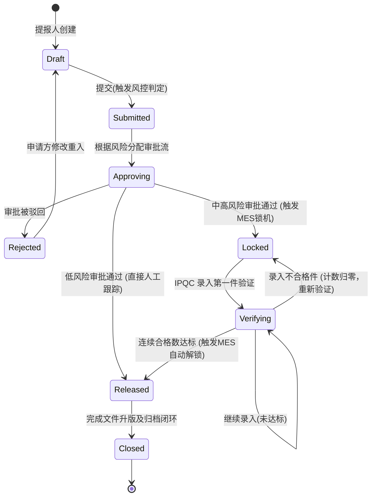
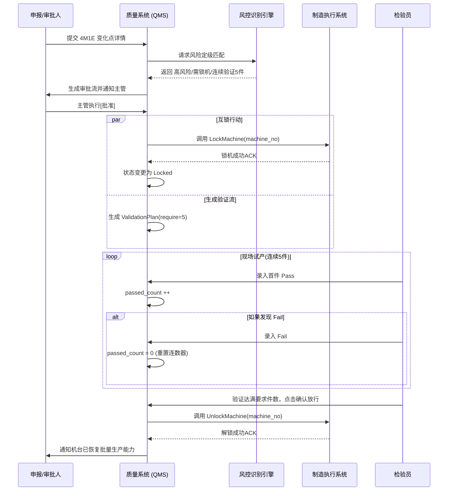

# 文档控制信息
- 文档编号：QMS-TDD-CPR-2.0
- 文档标题：变化点管理（Change Point Management）详细设计文档
- 版本：2.0
- 状态：已批准
- 编制日期：2026-03-06
- 依赖标准：IATF 16949:2016 §8.5.6 更改控制

---

## 1. 模块概述 (Module Overview)

### 1.1 背景与目标
在生产制造过程中，4M1E（人员、机器、物料、方法、环境及测量）的变化往往是导致质量事故的主要根因。传统依靠纸质单据审批的方式存在信息滞后、**缺乏物理拦截机制**的重大缺陷，经常导致未经试产验证的变化直接投入批量生产，造成成批废品。

本模块通过建立**变化点申报 -> 智能风险定级 -> 审批路由 -> MES 物理互锁 -> 强制验证放行**的数字化闭环，构建起一道基于系统的防错屏障。实现对生产现场变化的强管控，贯彻“风险未排除，机器不生产”的质量核心原则。

### 1.2 模块功能范围
- **变化点中央看板**：提供全局视角的 KPI、4M1E 占比图表、实时预警流及待办收件箱。
- **申报工作台与台账**：支持变化点的提报、状态流转跟踪、全量数据检索。
- **详情与编辑单**：两栏式沉浸表单，集成 4M1E 动态选择器及实时 MES 锁机日志流。
- **验证任务中心**：针对互锁机台的现场试产检验工具，提供连续合格件累加判定及解封功能。
- **风险引擎配置**：业务化的自动定级策略白板，支持通过关键词和 4M1E 类型动态控制阻断策略。

---

## 2. 核心业务流程 (Core Business Flows)

### 2.1 全流程状态机 (State Machine)
系统严格把控变化单 `ChangePointStatus` 的生命周期，确保流转合规可查。



### 2.2 核心系统级交互时序 (Sequence Diagram)
描述涉及多系统及多角色的协作路径。



---

## 3. 数据模型设计 (Data Model Design)

### 3.1 变化点主台账表 (`cp_record`)
主线数据承载表，支持所有维度的单据跟踪与汇总。

| 字段名 | 类型 | 必填 | 默认值 | 描述 |
|---|---|:---:|---|---|
| `id` | VARCHAR(36) | Y | | 业务主键 |
| `record_no` | VARCHAR(50) | Y | | 自定订单号，如 `CPR-YYYYMMDD-001` (Unique) |
| `title` | VARCHAR(200) | Y | | 简要变化描述/标题 |
| `status` | VARCHAR(20) | Y | `draft` | 见状态机。对应枚举 |
| `change_type` | VARCHAR(20) | Y | | 4M1E 根因类型 (`man`, `machine`, `material` 等) |
| `change_sub_type` | VARCHAR(100)| N | | 子场景归类 (如 `核心设备大修`) |
| `change_description` | TEXT | Y | | 具体发生原因、涉及型号文本长述 |
| `risk_level` | VARCHAR(10) | Y | | 风控引擎计算结果 (`low`, `medium`, `high`) |
| `reporter_id` | VARCHAR(36) | Y | | 提报人账户关联 |
| `mes_lock_time` | DATETIME | N | | 成功向 MES 下发物理锁截断的时间点 |
| `mes_unlock_time` | DATETIME | N | | 成功向 MES 下发释防指令的时间点 |

### 3.2 风控矩阵规则表 (`cp_risk_matrix_rule`)
决策大脑的策略存放表。前端 `RiskMatrixConfig.vue` 的底层支撑。

| 字段名 | 类型 | 必填 | 默认值 | 描述 |
|---|---|:---:|---|---|
| `id` | VARCHAR(36) | Y | | 策略内部ID |
| `change_type` | VARCHAR(20) | Y | | 引擎首层过滤条件 (4M1E分类) |
| `sub_type` | VARCHAR(100)| Y | | 规则业务名 |
| `keyword` | VARCHAR(500)| Y | | `,` 分隔的多关键词，用于 NLP 语义匹配模糊命中 |
| `default_risk_level`| VARCHAR(10) | Y | `medium` | 命中后对应的阻断等级 |
| `require_mes_lock` | BOOLEAN | Y | `FALSE` | 命中此规则是否激活硬件锁机 |
| `require_qe_approval` | BOOLEAN | Y | `FALSE` | 是否要求更高职级人员(QE)复核 |
| `is_active` | BOOLEAN | Y | `TRUE` | (软开关)规则是否启用加入评估树 |

### 3.3 试产验证方案表 (`cp_verification_plan`)
应对互锁解除的任务记录。

| 字段名 | 类型 | 必填 | 默认值 | 描述 |
|---|---|:---:|---|---|
| `id` | VARCHAR(36) | Y | | 方案主键 |
| `change_point_id` | VARCHAR(36) | Y | | 外键链接回主表 `cp_record` |
| `required_count` | INT | Y | | 该次阻断指定的硬性放行合格件数 |
| `passed_count` | INT | Y | `0` | **核心游标**：当前的持纯连续合格数。录入 fail 立刻归 0 |
| `deadline` | DATETIME | Y | | 最大容忍耗时，超期将产生严重预警推送 |
| `status` | VARCHAR(20) | Y | `pending`| `running` (执行中), `passed` (达标解除) |

### 3.4 单件验证记录表 (`cp_verification_task_item`)
每一件产品的鉴定存留（符合 ALCOA+ 数据追溯）。

| 字段名 | 类型 | 必填 | 默认值 | 描述 |
|---|---|:---:|---|---|
| `id` | VARCHAR(36) | Y | | 主键 |
| `plan_id` | VARCHAR(36) | Y | | 所属验证方案 (FK) |
| `sequence` | INT | Y | | 在本验证主线中的流水第 N 件 |
| `result` | VARCHAR(10) | Y | | `pass`, `fail`, `pending` |
| `inspector`| VARCHAR(50) | Y | | 质检员工号 |
| `note` | TEXT | N | | 备注或不良原因 |

---

## 4. 业务触发机制详细描述 (Business Trigger Mechanisms)

此四大触发器构成了系统的自动化底座：

### 4.1 自动定级评估器 (Auto Risk Evaluation)
* **触发时机**：用户在新建表单页，点击“提交”且填写完 `标题` 和 `详述` 字段。
* **执行步骤**：
  1. 系统拉取缓存中启用的 `cp_risk_matrix_rule` 表数据。
  2. 根据单据的 `change_type` 做主过滤。
  3. 对单据标题和描述进行模糊分词匹配，寻找是否交集到规则表里的 `keyword` (如命中“大修”、“模具”)。
  4. 提取匹配到的最高优先级的规则集，整合得出结论：需要分配哪种级别的安全等级（影响颜色和审批路由）及是否产生阻断拦截信号 (`require_mes_lock`)。

### 4.2 MES 锁机下发指令 (Lock Command Emit)
* **触发时机**：带有 `require_mes_lock=true` 的单据，审批人点击“同意批准”并落库成功时刻。
* **执行步骤**：
  1. 开启分布式事务准备。
  2. 向外部 MES API 发送阻断指令，指定机台号/工单号。
  3. 捕获 MES 的 `Ack:200` 并通过 `cp_record.status = locked`。若失败（断网/排班异常），进入容错队列轮询尝试（最大3次）。
  4. 新生出一条 `cp_verification_plan` 任务丢入检验员池中，进入等候处理期 (`pending`)。

### 4.3 惩罚性重置验证归零 (Verification Reset Trap)
* **触发时机**：验证过程中，若检验员判定其中任意一件产品质量为 `fail`。
* **执行步骤**：
  1. 将主验证规划表 (`cp_verification_plan`) 的 `passed_count` 强行覆盖改写为 `0`。
  2. UI 层面拦截任何企图直接解锁的放行操作按钮，展示红色错误警报。
  3. 后续产生的检测将从此中断点之后生成新 `sequence` 编号，必须再经历一次从头开始的连续累积检验。此时不可覆盖先前数据，以留存审计追溯。

### 4.4 自动释放防线 (Auto Release Command Emit)
* **触发时机**：检验员点击“确认放行”时。
* **执行步骤**：
  1. 在后端进行防串改校验：保证 `where status=running AND passed_count >= required_count` 成立（双杀校验）。
  2. 调用外部 MES API 发送放行（Unlock）指令。
  3. 落库日志并回写主业务单至 `released`（已准出）阶段，可恢复大批量报工。

---

## 5. 试生产验证任务中心详细设计 (Verification Center Design)

此模块从原先复杂的全页跳转变更为高效的工作台式交互。

### 5.1 页面布局设计
```text
┌───────────────────────────────────────────────────────────────────────┐
│ [导出台账] [刷新]  (Toolbar)                                          │
├───────────────────────────────────────────────────────────────────────┤
│ [🕐 待开始 1]  [🔄 验证中 2]  [⏰ 已超时 1]  [✅ 已放行 1] (状态摘要栏)│
├───────────────────────────────────────────────────────────────────────┤
│ 搜索: [单号/名称...]  状态: [下拉选择▼]                         [查询] │
├───────────────────────────────────────────────────────────────────────┤
│ 主列表 (Table)                                                        │
│ 单号       | 方案标题                 | 状态     | 合格进度 | 截止时间| │
│ CPR-001    | MC-02大修首件验证        | 验证中   | [██░░░]2/5| 1小时 |办理|
│ CPR-002    | 新卡尺引入比对验证       | 已放行   | [█████]5/5| ---   |查看|
└───────────────────────────────────────────────────────────────────────┘
   (点击"办理"在界面同层右侧平滑展开 Drawer 面板)
```

### 5.2 抽屉 (Drawer) 内核心交互结构
* **抬头看板**：展示 4 张关键数显卡（要求件数 / 已录件数 / **连续合格数** / 剩余时长）。突出当前检验达标的核心状况。
* **动态 Action Banner**：
  * 当未达标且无 fail：只展示录入入口。
  * 当存在 fail：展示红色警示语“验证中断，计数归零”，并提供危险动作按钮【重置并重新验证】。
  * 当连续合格达标：顶部出现巨型绿色横幅，并附带最核心业务按钮：**【确认放行 & MES 解锁】**（必须二次确认）。
* **可视操作流卡片网格**：替代原生 Table。每一件测试以方格呈现（灰⏳ / 绿✅ / 红❌），视觉清晰明确，并在 `pending` 件中暴露“录入”按钮弹窗完成信息填写。

---

## 6. 风险矩阵规则配置详细设计 (Risk Matrix Config Design)

为解决防错策略需依赖研发硬编码的问题而设立的业务开放面板。

### 6.1 页面布局设计
```text
┌───────────────────────────────────────────────────────────────────────┐
│ 风险评判矩阵规则配置  (IAFT16949质量引擎)          [导出配置] [+新增规则]│
├────────┬──────────────────────────────────────────────────────────────┤
│ 👷人   │ ⚙️机设备 相关规则                          [搜索: 换模... 🔍]│
│ ⚙️机 > │ -------------------------------------------------------------│
│ 📦料   │ [换模/大修] 关键词: 模具,换模,大修   预判: 🔴高风险           │
│ 📋法   │ 决策: 需QE复审、强制锁机(MES拦截)    状态: [🟢ON]  [改] [删]  │
│ 🌡️环   │ -------------------------------------------------------------│
│ 📐测   │ [设备保养]  关键词: 保养,点检        预判: 🟡中风险           │
│ 📝其他 │ 决策: 需QE复审                     状态: [🟢ON]  [改] [删]  │
└────────┴──────────────────────────────────────────────────────────────┘
```

### 6.2 规则配置与交互约束
* 侧边栏式 Tab 分类大幅减轻长卷轴认知负荷。
* 用户点击“+新增”或“编辑”，弹出大型表单页要求输入控制条件。采用结构化的卡片展示高、中、低基准风险（带明显色块）。
* 支持控制 `require_mes_lock` 硬件锁机的热更新选项，实现无需发版的拦截逻辑演进。
* 存在保护机制：停用（Toggle Off）是软阻断，删除会校验是否已有单据引用（前端设弹出强警告标红）。

---

## 7. 接口设计概览 (API Overview)

| 方法 | 路径 | 核心输入/输出 | 说明归总 |
|---|---|---|---|
| **POST**| `/api/cpr/report` | In: 4M1E单据报文 <br/>Out: `recordNo` | 创建申报单并同时在服务端挂载跑一遍风险规则测评分得出等级。 |
| **POST**| `/api/cpr/approve` | In: `{result: 'approved', comment: ''}` | 工作流通过，系统会内部检查若是高风险则发起 RPC 到 MES。 |
| **POST**| `/mes/interlock/lock` | In: `machine_no`, `cpr_id` | （对接系统用）强制锁柜机器，要求返回成功信号。 |
| **POST**| `/mes/interlock/unlock`| In: `machine_no`, `cpr_id` | （对接系统用）恢复机台释放生产能力。 |
| **POST**| `/api/cpr/verify/record`| In: `item_seq`, `result(pass/fail)`, `note`| 回写单件检验结果，并在内部核算 `passed_count` 长度。 |
| **POST**| `/api/cpr/admin/matrix`| In: Rule详情DTO | 刷新引擎参数字典库至 Redis。 |

---

## 8. 非功能性要求 (Non-functional Requirements)

| 类别 | 要求指标上限及措施 |
|---|---|
| **高性能/低延迟** | `OnSubmit` 时运行规则匹配使用内存缓存或 Redis 取数据，确保响应耗时 `< 500ms`。向 MES 的双向拦截网络请求必须设有 5s 的 Request Timeout 配置，并配合断路器机制。 |
| **高可用与重试容错** | 发生 MES 机房重启或者掉线时，系统的 Lock 锁柜信号必须具备延迟投递死信队列（MQ）补偿机制能力，防止漏洞产生。 |
| **安全性监控** | 引擎配置页 `RiskMatrixConfig` 仅白名单/预置职权管理员可进入，必须阻截提线员权限越界；任何释放锁截流动作将打带有操作IP的审计日志不可删除。 |
| **兼容性要求** | UI/UX 采用 AntD V4 及 Vue3 规范，兼容新世代 Chrome 及 Edge 分辨率至少在 1440x900 的满屏幕。响应式支持到 Pad 浏览器查看工作台。 |
| **数据完整性防篡改** | 符合 **ALCOA+ 质量审计法则**：操作一旦形成数据库落点记录后（特指验证 `fail`，锁机报表等），其主状态和关联时间戳不设 DELETE 操作，任何回滚只设补单式插入痕迹软修改。 |

---

## 9. 后续优化与迭代方向 (Future Evolutions)

* **1. 短期演进 (3-6 个月): 移动端扩展方案**
  目前侧重于 PC 端办公。短期内计划推出配套 PDA（扫码器/平板）H5 适配版本。生产现场班子使用企业微信 / 钉钉扫一扫机台直接呼出提报画面，IPQC 第一时间随手拍照不良品照片作为 `note` 附件上传至试产档案库中。
* **2. 短期演进 (3-6 个月): 关联系统级联升版**
  与文档系统级联。实现闭环状态 `closed` 后，直接推送给 PLM 研发部一份“技术指引修改意见书”（例如由于设备改造引发的 FMEA 或者 SOP 小步骤刷新指引）。
* **3. 中长期演进 (6-24 个月): 预测性监控引擎构建**
  收集超过千余张报修及盲动作记录积累出的自然词频（例如发生 "油温跳动" 的频率及最终废品的相关度），利用 LLM （大模型语义库）替换原本依靠手工维护的 `RiskMatrix` 策略池，做到无需配表，模型依据大数据在员工报单刹那进行隐患分析并推荐判定分数。
* **4. 中长期演进: 全局联控**
  除了阻断 MES 生产模块外，级联阻断 WMS 系统发料动作（若物料型危险尚未解除，仓库锁定这批代号的原物料禁止被扫码出库配送）。

---

> **建议存储路径**：/PRD/改进与行动/变化点管理/QMS-TDD-变化点管理-v2.0.md
> 
> *需在工程根目录核实/创建此文档目录以纳入文档树控制。*
