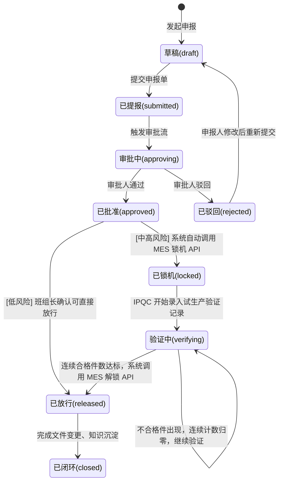
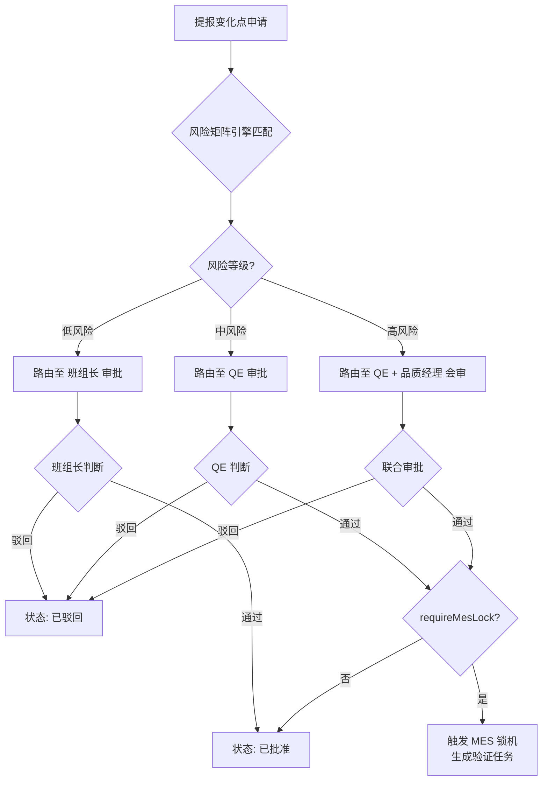
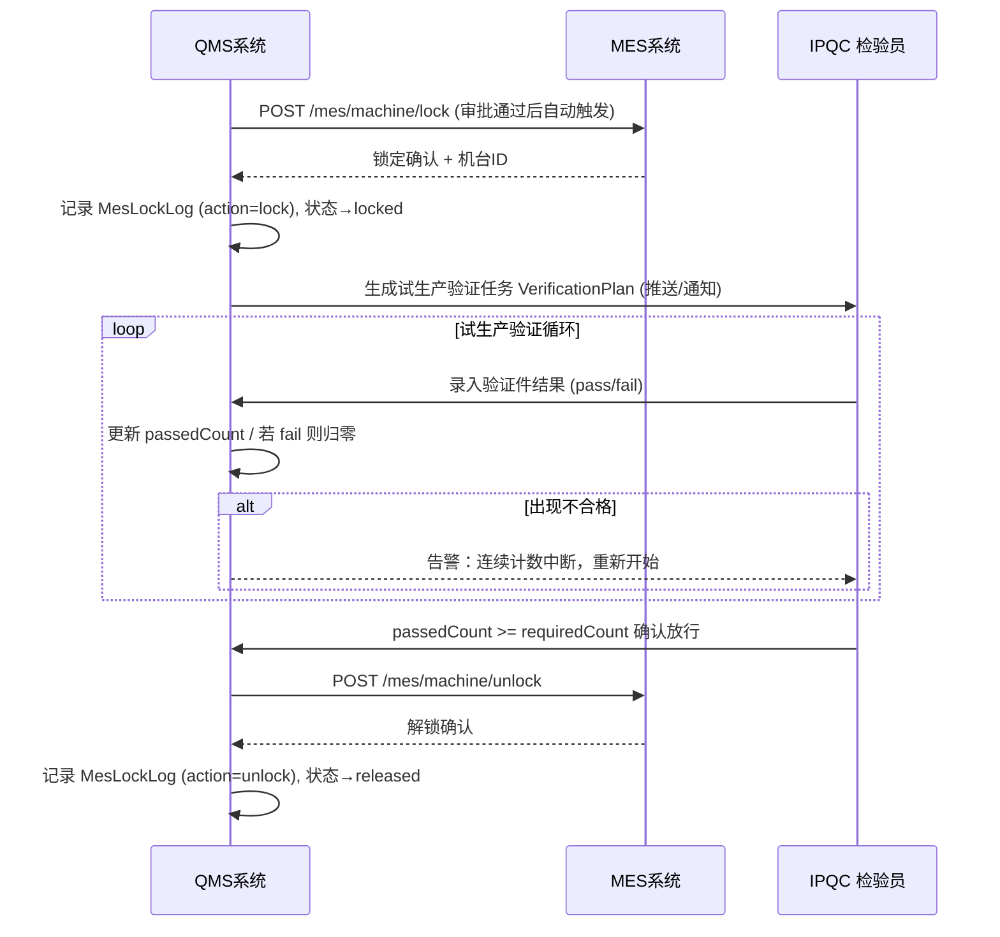

# 变化点管理（Change Point Management）详细设计文档

**版本：** V1.0
**更新日期：** 2026-03-05
**所属模块：** 改进与行动 / 变化点管理
**依赖标准：** IATF 16949:2016 §8.5.6 变更控制

---

## 1. 模块概述

### 1.1 背景与目标

生产制造过程中，4M1E（人 Man、机 Machine、料 Material、法 Method、环 Environment、测 Measure）的变化是引发批量质量问题的最主要根因之一。传统的纸质审批、口头确认方式存在如下核心痛点：

- **信息孤立**：变化申报与 MES 生产系统完全割裂，审批批准后无法阻止未经验证的物料/工单进入批量生产。
- **流程断档**：中高风险变化缺乏强制的试生产验证关卡，凭经验判断放行。
- **预警滞后**：机台被人为绕开（"盲动报工"）时无实时监控和推送。
- **知识流失**：变化处理案例分散，无法积累到质量知识库指导后续决策。

本模块通过**结构化提报→智能风险定级→分层审批路由→MES 互锁防呆→强制试产验证→知识闭环**六个核心机制，形成端到端的变化点数字化管控体系。

### 1.2 模块范围

| 端 | 功能 |
|---|---|
| **PC 端（核心）** | 变化点台账与追溯列表、申报/编辑/查看详情页、试生产验证任务中心、变化点中央看板、风险矩阵规则配置 |
| **PDA/移动端（辅助）** | 现场一键申报页（4M1E 大图标分类）、现场验证录入、班组长快速审批 _(待实现)_ |
| **系统集成** | MES 互锁 API（锁机/解锁）、钉钉通知推送 _(待实现)_ |

---

## 2. 核心业务流程

### 2.1 全流程状态机



### 2.2 风险分级与自动路由机制



### 2.3 MES 互锁与试产放行流程



---

## 3. 数据模型设计（数据库表结构）

### 3.1 主表：`cp_record`（变化点处理单台账）

| 字段名 | 类型 | 必填 | 默认值 | 描述 |
|---|---|:---:|---|---|
| `id` | VARCHAR(36) | Y | UUID | 主键 |
| `record_no` | VARCHAR(50) | Y | — | 系统生成单号，格式：`CPR-YYYYMMDD-NNN`，全局唯一 |
| `title` | VARCHAR(200) | Y | — | 变化点标题摘要 |
| `org_id` | VARCHAR(36) | N | — | 归属工厂/组织 ID |
| `risk_level` | VARCHAR(10) | Y | — | 风险等级枚举：`low` / `medium` / `high` |
| `risk_score` | INT | N | — | 风险引擎计算的综合得分（供参考，取值 1-100） |
| `risk_description` | TEXT | N | — | 风险评估说明文字 |
| `status` | VARCHAR(20) | Y | `draft` | 状态枚举（见 §2.1 状态机） |
| `reporter_id` | VARCHAR(36) | Y | — | 提报人 ID（关联员工/用户表） |
| `reporter_name` | VARCHAR(50) | Y | — | 提报人姓名（冗余） |
| `reporter_dept` | VARCHAR(100) | N | — | 提报人部门 |
| `report_time` | DATETIME | Y | NOW() | 提报时间 |
| `approver_id` | VARCHAR(36) | N | — | 最终审批人 ID |
| `approve_time` | DATETIME | N | — | 审批完成时间 |
| `approve_comment` | TEXT | N | — | 审批意见 |
| `mes_lock_time` | DATETIME | N | — | MES 锁机执行时间 |
| `mes_unlock_time` | DATETIME | N | — | MES 解锁执行时间 |
| `verification_plan_id` | VARCHAR(36) | N | — | 关联的试生产验证任务 ID（FK） |
| `closed_by` | VARCHAR(36) | N | — | 业务闭环操作人 ID |
| `close_time` | DATETIME | N | — | 闭环时间 |
| `close_comment` | TEXT | N | — | 闭环说明 |
| `saved_to_knowledge` | BOOLEAN | Y | FALSE | 是否已沉淀至质量知识库 |
| `create_time` | DATETIME | Y | NOW() | 创建时间 |
| `update_time` | DATETIME | Y | NOW() | 最后更新时间 |

---

### 3.2 变化明细子表：`cp_change_detail`（4M1E 变化内容）

每条主表单据对应一条变化明细，描述该次变化的具体内容与影响范围。

| 字段名 | 类型 | 必填 | 描述 |
|---|---|:---:|---|
| `id` | VARCHAR(36) | Y | 主键 |
| `record_id` | VARCHAR(36) | Y | 关联主表 `cp_record.id`（FK） |
| `change_type` | VARCHAR(20) | Y | 4M1E 大类枚举：`man` / `machine` / `material` / `method` / `environment` / `measure` / `other` |
| `change_sub_type` | VARCHAR(50) | Y | 具体子类，如「新员工上岗」/「设备大修」/「供应商切换」 |
| `change_description` | TEXT | Y | 详细变化描述 |
| `affected_product` | VARCHAR(100) | N | 受影响产品编号或名称 |
| `affected_process` | VARCHAR(100) | N | 受影响工序名称 |
| `affected_machine` | VARCHAR(100) | N | 受影响机台编号 |
| `affected_material` | VARCHAR(100) | N | 受影响物料编号 |
| `before_state` | TEXT | N | 变化前状态描述（对比性记录，便于追溯） |
| `after_state` | TEXT | N | 变化后状态描述 |

---

### 3.3 风险矩阵规则表：`cp_risk_matrix_rule`（自动定级引擎规则）

系统的风险定级「大脑」。管理员按变化类型和关键词配置匹配规则，变化点提报时自动计算风险等级。

| 字段名 | 类型 | 必填 | 默认值 | 描述 |
|---|---|:---:|---|---|
| `id` | VARCHAR(36) | Y | UUID | 主键 |
| `change_type` | VARCHAR(20) | Y | — | 匹配的 4M1E 大类 |
| `sub_type` | VARCHAR(50) | N | — | 匹配的子类（为空则通配该大类所有子类） |
| `keywords` | VARCHAR(500) | N | — | 关键词列表（逗号分隔），用于扫描变化描述文本进行语义匹配 |
| `default_risk_level` | VARCHAR(10) | Y | — | 匹配后赋予的默认风险等级：`low` / `medium` / `high` |
| `require_qe_approval` | BOOLEAN | Y | FALSE | 是否需要 QE 审批 |
| `require_director_approval` | BOOLEAN | Y | FALSE | 是否需要品质经理/总监审批 |
| `require_mes_lock` | BOOLEAN | Y | FALSE | **关键字段**：审批通过后是否强制触发 MES 互锁 |
| `required_trial_count` | INT | N | 3 | 若需 MES 互锁，对应的试生产要求连续合格件数 |
| `alert_timeout_hours` | INT | N | 4 | 锁机后验证超时告警阈值（小时） |
| `description` | TEXT | N | — | 该规则的业务说明 |
| `is_active` | BOOLEAN | Y | TRUE | 是否启用该规则 |
| `sort_order` | INT | Y | 99 | 规则匹配优先级（越小越优先），当多条规则命中时取最高风险等级 |
| `create_time` | DATETIME | Y | NOW() | 创建时间 |
| `update_time` | DATETIME | Y | NOW() | 更新时间 |

> **引擎计算逻辑：** 提报时，系统同时进行两轮匹配：①精确匹配（change_type + sub_type）；②关键词匹配（扫描 change_description 文本）。所有命中规则中，取优先级最高（`sort_order` 最小）的一条作为最终定级依据。当多条规则的风险等级不同时，取最高风险等级（高>中>低）。

---

### 3.4 审批流记录表：`cp_approval_log`（审批轨迹明细）

| 字段名 | 类型 | 必填 | 描述 |
|---|---|:---:|---|
| `id` | VARCHAR(36) | Y | 主键 |
| `record_id` | VARCHAR(36) | Y | 关联 `cp_record.id` |
| `sequence` | INT | Y | 审批顺序序号 |
| `approver_id` | VARCHAR(36) | Y | 审批人 ID |
| `approver_name` | VARCHAR(50) | Y | 审批人姓名（冗余） |
| `approver_role` | VARCHAR(50) | Y | 审批角色（如：班组长、QE、品质经理） |
| `action` | VARCHAR(20) | Y | 操作枚举：`approve`（通过）/ `reject`（驳回）/ `pending`（待处理） |
| `comment` | TEXT | N | 审批意见或驳回原因 |
| `action_time` | DATETIME | N | 审批操作时间 |

---

### 3.5 MES 互锁日志表：`cp_mes_lock_log`（互锁追溯）

记录每一次向 MES 下发锁定/解锁指令的结果及响应，用于责任追溯与审计。

| 字段名 | 类型 | 必填 | 描述 |
|---|---|:---:|---|
| `id` | VARCHAR(36) | Y | 主键 |
| `record_id` | VARCHAR(36) | Y | 关联 `cp_record.id` |
| `action` | VARCHAR(20) | Y | 操作枚举：`lock`（锁机）/ `unlock`（解锁）/ `violation`（盲动报工告警） |
| `machine_no` | VARCHAR(50) | N | 受控机台编号 |
| `work_order_id` | VARCHAR(50) | N | 受控工单号（如按工单锁定） |
| `operator_id` | VARCHAR(36) | N | 操作发起人（系统自动触发时为系统账号） |
| `operation_time` | DATETIME | Y | 操作执行时间 |
| `mes_response_code` | VARCHAR(20) | N | MES 接口响应状态码 |
| `result` | VARCHAR(10) | Y | 执行结果：`success` / `fail` |
| `note` | TEXT | N | 备注说明（如失败原因、盲动报工的报工单号） |

---

### 3.6 试生产验证方案表：`cp_verification_plan`（验证任务主表）

中高风险变化点锁机后，系统自动创建此记录，驱动后续的强制试产验证流程。

| 字段名 | 类型 | 必填 | 默认值 | 描述 |
|---|---|:---:|---|---|
| `id` | VARCHAR(36) | Y | UUID | 主键 |
| `record_id` | VARCHAR(36) | Y | — | 关联 `cp_record.id`（FK），一对一关系 |
| `plan_title` | VARCHAR(200) | Y | — | 验证方案标题（通常自动生成，如："MC-03 换模后首件验证") |
| `required_count` | INT | Y | — | 要求连续合格件数（从风险矩阵规则 `required_trial_count` 继承） |
| `completed_count` | INT | Y | 0 | 已完成（录入结果）的件数 |
| `passed_count` | INT | Y | 0 | 当前连续合格件的计数（出现不合格时归零） |
| `consecutive_fail_count` | INT | Y | 0 | 当前连续不合格计数（用于触发自动中止逻辑） |
| `verifier_id` | VARCHAR(36) | Y | — | 验证责任人（IPQC） ID |
| `verifier_name` | VARCHAR(50) | Y | — | 验证责任人姓名（冗余） |
| `qe_approver_id` | VARCHAR(36) | N | — | QE 确认人 ID（验证完成后由 QE 最终确认放行） |
| `deadline` | DATETIME | Y | — | 要求完成验证的截止时间（自锁机时间起 + `alert_timeout_hours`） |
| `status` | VARCHAR(20) | Y | `pending` | 状态枚举：`pending`（待开始）/ `running`（验证中）/ `passed`（已通过）/ `failed`（验证失败放弃） |
| `create_time` | DATETIME | Y | NOW() | 创建时间 |
| `update_time` | DATETIME | Y | NOW() | 更新时间 |

---

### 3.7 单件验证记录表：`cp_verification_item`（验证明细）

每次录入一个试产件的检验结果，生成一条记录。

| 字段名 | 类型 | 必填 | 描述 |
|---|---|:---:|---|
| `id` | VARCHAR(36) | Y | 主键 |
| `plan_id` | VARCHAR(36) | Y | 关联 `cp_verification_plan.id` |
| `sequence` | INT | Y | 批次序号（第几件，从 1 开始递增） |
| `inspector_id` | VARCHAR(36) | Y | 检验员 ID |
| `inspector_name` | VARCHAR(50) | Y | 检验员姓名（冗余） |
| `inspect_time` | DATETIME | Y | 检验时间 |
| `result` | VARCHAR(10) | Y | 检验结果：`pass`（合格）/ `fail`（不合格）/ `pending`（待检） |
| `note` | TEXT | N | 不合格描述或备注说明 |
| `attachments` | JSON | N | 现场照片附件路径列表 |

---

### 3.8 预警通知表：`cp_alert_record`（系统预警）

存储系统自动产生的实时预警消息，用于前端看板展示和追溯。

| 字段名 | 类型 | 必填 | 描述 |
|---|---|:---:|---|
| `id` | VARCHAR(36) | Y | 主键 |
| `record_id` | VARCHAR(36) | Y | 关联 `cp_record.id` |
| `record_no` | VARCHAR(50) | Y | 冗余单号，避免 JOIN |
| `alert_type` | VARCHAR(30) | Y | 预警类型：`blind_move`（盲动报工红色预警）/ `verification_timeout`（验证超时橙色预警） |
| `severity` | VARCHAR(10) | Y | 严重等级：`red` / `orange` |
| `message` | TEXT | Y | 预警消息正文 |
| `trigger_time` | DATETIME | Y | 触发时间 |
| `notified_users` | JSON | N | 已推送通知的用户 ID 列表 |
| `is_read` | BOOLEAN | Y | 是否已被确认/处理 |
| `read_by` | VARCHAR(36) | N | 确认人 ID |
| `read_time` | DATETIME | N | 确认时间 |

---

## 4. 业务触发机制详细说明

### 4.1 风险定级引擎（Risk Engine）

**触发时机：** 申报人填写完基本信息并选择 4M1E 类型后，点击「提交申报」时同步调用。

**计算步骤：**
1. 从 `cp_risk_matrix_rule` 加载所有 `is_active = TRUE` 的规则，按 `sort_order` 升序排列。
2. 按如下优先级进行逐条规则匹配：
   - **精确匹配**：`change_type` + `sub_type` 完全一致。
   - **大类通配**：仅 `change_type` 一致，`sub_type` 为空。
   - **关键词匹配**：遍历 `keywords` 列表，与 `change_description` 做模糊匹配（含 → 命中）。
3. 所有命中规则中，按如下优先级取最终结果：
   - 若有多条命中，取 `sort_order` 最小的一条作为「代表规则」。
   - 风险等级取所有命中规则中的最高级（high > medium > low）。
   - `require_mes_lock`、`require_qe_approval`、`require_director_approval` 采用逻辑「OR 并集」，任一规则要求则整体要求。
4. 若无任何规则命中，回退到系统兜底配置（默认 `low` 风险，仅班组长审批）。

### 4.2 MES 互锁触发（Lock Trigger）

**触发条件：** 变化点状态由 `approving` 变更为 `approved`，且对应匹配规则 `require_mes_lock = TRUE`。

**执行步骤：**
```
审批通过 (OnApprove Event)
  ├── if: require_mes_lock == true
  │     ├── 1. 调用 MES Agent: POST /api/mes/control/lock-machine
  │     │       Body: { recordNo, machineNo, workOrderId, reason }
  │     ├── 2. 记录响应到 cp_mes_lock_log (action=lock)
  │     ├── 3. 更新 cp_record.status = 'locked', mes_lock_time = NOW()
  │     ├── 4. 创建 cp_verification_plan 记录
  │     │       - required_count 从匹配规则 required_trial_count 读取
  │     │       - deadline = NOW() + alert_timeout_hours (小时)
  │     └── 5. 推送通知给 IPQC 驻线检验员（钉钉/站内信）
  └── else
        └── 直接更新 cp_record.status = 'approved'
```

### 4.3 MES 解锁触发（Unlock Trigger）

**触发条件：** IPQC 在验证任务中心点击「确认放行」，且 `passed_count >= required_count`。

**执行步骤：**
```
放行操作 (OnRelease Event)
  ├── 1. 校验: passed_count >= required_count (服务端再次验证，防止绕过前端)
  ├── 2. 调用 MES Agent: POST /api/mes/control/unlock-machine
  │       Body: { recordNo, machineNo, workOrderId, verificationPlanId }
  ├── 3. 记录响应到 cp_mes_lock_log (action=unlock)
  ├── 4. 更新 cp_record.status = 'released', mes_unlock_time = NOW()
  └── 5. 更新 cp_verification_plan.status = 'passed'
```

### 4.4 盲动报工预警（Blind Move Alert）

**触发条件：** 当变化点处于 `locked` 或 `verifying` 状态期间，MES 主动回调通知 QMS 有该机台的批量报工数据。

**执行步骤：**
```
MES 盲动回调 (POST /api/qms/webhook/mes-violation)
  ├── 1. 解析机台编号，查询对应 locked/verifying 状态的 cp_record
  ├── 2. 在 cp_mes_lock_log 新增记录 (action=violation)
  ├── 3. 在 cp_alert_record 新增红色预警记录
  └── 4. 通过钉钉发送「DING 消息」给生产总监和品质总监（高优先级）
```

### 4.5 验证超时预警（Verification Timeout Alert）

**触发条件：** 定时任务（每 15 分钟）扫描所有已超过 `deadline` 但状态仍为 `running` 的 `cp_verification_plan` 记录。

**执行步骤：**
```
定时任务 (Cron: */15 * * * *)
  ├── 1. 查询: deadline < NOW() AND status = 'running' AND alert_sent = FALSE
  ├── 2. 对每条记录新增 cp_alert_record (alert_type=verification_timeout, severity=orange)
  └── 3. 通过钉钉发送橙色超时催办通知给验证责任人和 QE
```

---

## 5. 试生产验证任务中心详细设计

### 5.1 页面布局设计（PC 端）

采用「**顶部搜索区 + 全宽主列表表格 + 右侧平滑抽屉（Drawer）**」的三段式 PC 端标准布局，优于传统的左右双栏固定布局（后者更适合 Pad 端）。

```
┌───────────────────────── 顶部 Toolbar（操作按钮）──────────────────────────┐
├───────────────────── 搜索筛选卡片（关键字 / 状态 / 时间范围）──────────────┤
│                                                                              │
│   验证任务主列表（全宽 Table）                                               │
│   ┌──────────┬──────────────┬──────────┬───────────────┬────────┬──────┐   │
│   │ 关联单号  │  验证方案标题  │   状态   │  验证进度条   │ 截止时间│ 操作 │   │
│   ├──────────┼──────────────┼──────────┼───────────────┼────────┼──────┤   │
│   │ CPR-001  │ MC-02 换模验证│  验证中  │ ████░ 2/3合格 │ -1h 超时│ 办理 │   │
│   │ CPR-004  │ 新量具比对验证 │  已通过  │ █████ 5/5合格 │ 完成  │ 查看 │   │
│   └──────────┴──────────────┴──────────┴───────────────┴────────┴──────┘   │
└──────────────────────────────────────────────────────────────────────────────┘
                                              │ 点击「办理」/「查看」
                                              ▼
                                ┌──── 右侧滑出 Drawer（宽 800px）────┐
                                │  验证任务头部（标题 + 状态标签）     │
                                │  ┌───┬───┬───┬───┐                │
                                │  │要求│已验│连续│剩余│ ← 四格数据卡 │
                                │  │ 3 │ 2 │ 2 │1h │                │
                                │  └───┴───┴───┴───┘                │
                                │  [告警/放行] 动态操作区             │
                                │  验证明细记录表格（带录入按钮）      │
                                └────────────────────────────────────┘
```

### 5.2 核心交互逻辑

| 场景 | 系统响应 |
|---|---|
| `passedCount >= requiredCount` 且状态为 `running` | 在抽屉顶部展示 **绿色成功告警框**，并出现「✅ 确认放行（MES解锁）」操作按钮 |
| 验证件出现 `fail` 结果 | `passedCount` 归零，展示 **红色危险告警框**，给出「重新开始验证」按钮 |
| 当前时间超过 `deadline` 且未完成 | 截止时间列以红色高亮显示，并在抽屉内展示超时警示 |
| 状态为 `passed`（已完成放行） | 只读展示，进度条为绿色 100%，不允许继续录入 |

---

## 6. 风险矩阵规则配置详细设计

### 6.1 页面功能概述

该页面为「超级管理员 / 品质工程师专区」，是整个变化点管理模块的「规则大脑」。通过在此页面编辑规则，即可全厂实时调整变化点的自动定级逻辑和审批路由，无需任何代码变更。

### 6.2 规则配置维度

每条规则可配置以下关键决策项：

| 配置项 | 类型 | 说明 |
|---|---|---|
| **4M1E 大类** | 枚举 | 规则所属的变化类型，用于 Tab 页签分类展示 |
| **子类** | 文本/枚举 | 精确匹配子类型（可为空，表示通配该大类） |
| **匹配关键词** | 标签列表 | 从提报文本中语义检索匹配（如：大修、停机、新员工） |
| **默认风险等级** | low/medium/high | 命中该规则后赋予的基准风险等级 |
| **审批路由** | 复选 | 是否需要 QE、是否需要品质经理联合审批 |
| **MES 互锁** | 开关 | 是否在审批通过后强制触发 MES 锁机 |
| **试产件数** | 整数 | MES 互锁后要求的连续合格件数（如 3、5、10） |
| **超时阈值** | 整数（小时） | 锁机后超过多少小时未完成验证则发橙色预警 |
| **规则优先级** | 整数 | 多规则命中时的解析优先级（越小越优先） |
| **启用/停用** | 开关 | 临时停用某条规则但不删除 |

### 6.3 页面布局交互

```
┌── 4M1E 分类 Tab 页签 ──────────────────────────────────────────────┐
│  人(Man)  │  机(Machine)  │  料(Material)  │  法(Method)  │  ...  │
├────────────────────────────────────────────────────────────────────┤
│  Toolbar: [+ 新增规则]  [导出配置]                                  │
│                                                                     │
│  规则列表 Table                                                     │
│  ┌──────┬────────┬──────┬────────┬──────┬─────────┬──────┐        │
│  │ 子类  │ 关键词 │风险级│需QE审批 │互锁? │试产件数  │ 操作 │        │
│  ├──────┼────────┼──────┼────────┼──────┼─────────┼──────┤        │
│  │ 大修  │大修/停机│高风险│  ✅   │ ✅  │    3    │编辑  │        │
│  │ 换模  │换模/模具│中风险│  ✅   │ ✅  │    3    │编辑  │        │
│  │ 新员工│上岗/调岗│低风险│  ❌   │ ❌  │    —    │编辑  │        │
│  └──────┴────────┴──────┴────────┴──────┴─────────┴──────┘        │
└────────────────────────────────────────────────────────────────────┘
```

---

## 7. 前端组件规划

| 组件文件 | 功能描述 |
|---|---|
| `ChangePointList.vue` | 变化点台账列表；支持搜索筛选、状态流转、审批弹窗、MES日志查看 |
| `ChangePointEdit.vue` | 申报/编辑/查看单据详情；4M1E 卡片式选择器；风险评估展示；附件上传 |
| `VerificationCenter.vue` | 试生产验证任务主列表 + Drawer 办理；进度条；放行/重置操作 |
| `ChangePointDashboard.vue` | 中央看板；统计卡片；ECharts 风险分布图与趋势折线；实时预警列表 |
| `RiskMatrixConfig.vue` | 风险矩阵规则配置；Tab 分类；新增/编辑规则弹窗；启用/停用开关 |

---

## 8. 后端 API 接口概览

| 方法 | 路径 | 描述 |
|---|---|---|
| `POST` | `/api/v1/change-point/records` | 创建变化点申报单（触发风险引擎） |
| `GET` | `/api/v1/change-point/records` | 分页查询变化点台账列表（支持多维过滤） |
| `GET` | `/api/v1/change-point/records/:id` | 获取单据详情（含 MES 日志、验证任务） |
| `PUT` | `/api/v1/change-point/records/:id` | 更新草稿单据内容 |
| `POST` | `/api/v1/change-point/records/:id/status` | 执行状态变更（提交、审批、驳回、闭环） |
| `GET` | `/api/v1/change-point/verification-plans` | 查询试生产验证任务列表 |
| `GET` | `/api/v1/change-point/verification-plans/:id` | 获取验证任务详情（含各件明细） |
| `POST` | `/api/v1/change-point/verification-plans/:id/items` | 录入单件验证结果 |
| `POST` | `/api/v1/change-point/verification-plans/:id/release` | 确认放行（触发 MES 解锁） |
| `GET` | `/api/v1/change-point/risk-matrix/rules` | 查询风险矩阵规则列表 |
| `POST` | `/api/v1/change-point/risk-matrix/rules` | 新增规则 |
| `PUT` | `/api/v1/change-point/risk-matrix/rules/:id` | 更新规则 |
| `DELETE` | `/api/v1/change-point/risk-matrix/rules/:id` | 删除规则 |
| `POST` | `/api/v1/change-point/risk-matrix/evaluate` | 实时评估（前端提报时预览风险等级） |
| `GET` | `/api/v1/change-point/dashboard/stats` | 看板统计数据（当日/当月汇总） |
| `GET` | `/api/v1/change-point/alerts` | 查询预警通知列表 |
| `POST` | `/api/qms/webhook/mes-violation` | 接收 MES 盲动报工回调（Webhook） |

---

## 9. 非功能性要求

| 类别 | 要求 |
|---|---|
| **安全** | 风险矩阵规则配置页仅超级管理员/品质工程师角色可访问；放行操作需要二次确认弹窗 |
| **数据完整性** | MES 互锁成功响应后才允许更新单据状态；若 MES 接口调用失败，系统记录失败日志并告警，不自动修改状态 |
| **审计追溯** | 所有状态变更、审批操作、MES 互锁动作必须完整记录于对应日志表，永久保留不可删除 |
| **超时容错** | MES API 调用超时阈值为 10 秒；若超时，系统自动重试最多 3 次，并在最终失败后触发站内告警 |
| **预警实时性** | 盲动报工预警必须在 MES 回调后 30 秒内完成推送；超时验证扫描间隔不超过 15 分钟 |
