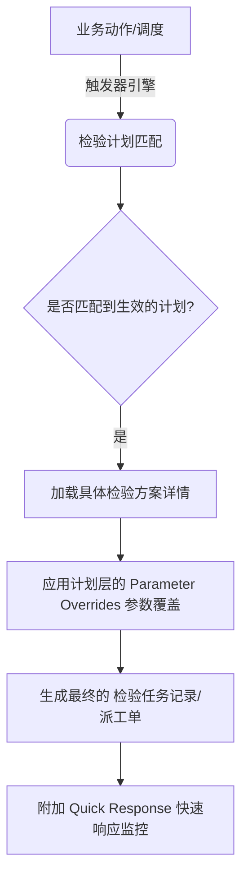

# 检验计划模型 详细设计文档

## 1. 模块概述

**检验计划模型（Inspection Plan Model）**是 QMS 系统中连接"业务/生产执行"与"质量检验标准"的核心调度神经枢纽。
向上，它承接来自 ERP/MES 等系统的各类单据动作（如采购收货、工单开工）及时间调度任务；向下，它将具体的《检验方案》（包含项目明细、抽样规则等）分发为可执行的《检验任务记录》。

### 1.1 核心目标
- **业务解耦：** 将检验标准与业务单据触发逻辑剥离，提升质量标准的复用性。
- **动态调度：** 支持事件驱动、时间周期驱动、数量批次驱动等多维度的触发机制。
- **柔性适配：** 提供"参数覆盖（Parameter Overrides）"功能，允许在计划层面对同一标准方案的不同应用场景（如A客户与B客户对同一工序的公差要求不同）进行微调。
- **全生命周期管控：** 实现计划的版本管理（草稿->生效->作废）与多组织（集团到工厂）的继承下发机制。

---

## 2. 核心架构与业务流程

### 2.1 业务触发流程架构

### 2.2 多组织业务支持模型
- **集团级：** 制订基础检验方案（Scheme）与标准检验计划模板（Org为空）。
- **工厂级：** 复制集团模板生成本地计划（Org对应具体工厂ID），可重新分配执行人、覆盖部分公差、调整触发频次等，形成独立版本的本地计划记录。

---

## 3. 数据模型设计 (数据库表结构)

模型采用主从表结构设计，以支撑高复杂度的层级定义。

### 3.1 主表：`qms_insp_plan` (检验计划主表)

| 字段名 (Field) | 类型 (Type) | 必填 | 默认值 | 描述 (Description) |
| --- | --- | :---: | --- | --- |
| `id` | VARCHAR(36) | Y | UUID | 主键 |
| `org_id` | VARCHAR(36) | N | NULL | 归属组织ID。NULL代表集团级，有值代表具体工厂 |
| `scheme_id` | VARCHAR(36) | Y | - | 关联的检验方案主键（FK） |
| `plan_code` | VARCHAR(50) | Y | - | 检验计划编码（如：PLN-HFC-001），唯一约束 |
| `plan_name` | VARCHAR(100)| Y | - | 检验计划名称 |
| `version` | VARCHAR(20) | Y | 'V1.0' | 版本号 |
| `plan_status` | VARCHAR(20) | Y | 'DRAFT' | 状态枚举：DRAFT(草稿), ACTIVE(生效), SUSPENDED(挂起), OBSOLETE(作废) |
| `insp_type` | VARCHAR(20) | Y | - | 检验类别：IQC, IPQC, FQC, OQC, PATROL |
| `material_id` | VARCHAR(36) | N | - | 关联的特定物料（仅在特定物料需设定专属计划时使用） |
| `trigger_type` | VARCHAR(20) | Y | - | 触发类型枚举：EVENT(事件), TIME(周期), QUANTITY(数量), MANUAL(手动) |
| `executor_id` | VARCHAR(36) | N | - | 默认执行人（检验员）ID |
| `backup_executor_id` | VARCHAR(36)| N | - | 备选执行人ID |
| `reviewer_id` | VARCHAR(36) | N | - | 审核人/主管ID |
| `defect_disposition`| VARCHAR(50)| N | - | 默认不良处理方式：SCRAP, REWORK, CONCESSION, RETURN_SUPPLIER |
| `copy_from_id`| VARCHAR(36) | N | - | 继承来源计划的ID（用于追溯工厂是复用了哪个集团模板） |
| `is_latest_version`| BOOLEAN | Y | true | 标识是否为最新版本，用于列表过滤 |
| `create_time` | DATETIME | Y | NOW() | 创建时间 |
| `update_time` | DATETIME | Y | NOW() | 更新时间 |

### 3.2 触发器配置子表：`qms_insp_plan_trigger`
*为保证良好的拓展性，将三种触发模式相关的详情放在独立的子表中，或作为JSON列存储在主表，此处设计为物理子表。*

| 字段名 (Field) | 类型 (Type) | 必填 | 描述 (Description) |
| --- | --- | :---: | --- |
| `plan_id` | VARCHAR(36) | Y | 关联 `qms_insp_plan.id` (PK, FK) |
| `erp_doc_type` | VARCHAR(50) | N | 【事件触发】ERP业务单据类型（如：PURCHASE_RECEIVE, PRODUCTION_ORDER）|
| `erp_doc_status` | VARCHAR(50) | N | 【事件触发】触发动作节点（如：SUBMITTED, IN_WAREHOUSE）|
| `custom_event_name` | VARCHAR(100)| N | 【事件触发】外部自定义事件名称标识符 |
| `cron_expression` | VARCHAR(50) | N | 【周期触发】Cron 表达式（如 `0 0 8 * * ?`）|
| `frequency_type` | VARCHAR(20) | N | 【周期触发】可视化频率分类（HOURLY, DAILY, WEEKLY, MONTHLY）|
| `frequency_value` | INT | N | 【周期触发】频率步长值 |
| `quantity_threshold`| INT | N | 【数量触发】触发阈值 |
| `quantity_unit` | VARCHAR(20) | N | 【数量触发】触发单位（PIECES件, MOLD模, BATCH批次） |
| `match_description` | VARCHAR(255)| N | 触发匹配逻辑描述/备注说明 |

### 3.3 参数覆盖明细表：`qms_insp_plan_override`
*针对具体检验计划中，需要修改关联方案原定义的数据上限/下限/目标值而设立的映射表。*

| 字段名 (Field) | 类型 (Type) | 必填 | 描述 (Description) |
| --- | --- | :---: | --- |
| `id` | VARCHAR(36) | Y | 主键 |
| `plan_id` | VARCHAR(36) | Y | 关联 `qms_insp_plan.id` |
| `scheme_detail_id` | VARCHAR(36) | Y | 关联方案中某项目的ID `qms_insp_scheme_detail.id` |
| `insp_item_name` | VARCHAR(100)| N | (冗余)检验项目名，方便显示检索 |
| `target_value` | DECIMAL(10,4)| N | 新的目标值 |
| `upper_limit` | DECIMAL(10,4)| N | 新的规格上限 |
| `lower_limit` | DECIMAL(10,4)| N | 新的规格下限 |
| `gauge_type_id` | VARCHAR(36) | N | 变更选用的量检具类型ID |
| `override_reason` | VARCHAR(255)| N | 调整参数的原因 |

### 3.4 快速响应配置表：`qms_insp_plan_qr` (Quick Response)
*配置与此检验计划相关的高级警报通知体系。*

| 字段名 (Field) | 类型 (Type) | 必填 | 描述 (Description) |
| --- | --- | :---: | --- |
| `plan_id` | VARCHAR(36) | Y | 关联主键 `qms_insp_plan.id` (PK) |
| `enabled` | BOOLEAN | Y | 是否开启快速响应监控 |
| `response_level` | VARCHAR(20) | N | 响应等级：NORMAL(普通), HIGH(高), CRITICAL(紧急) |
| `email_alert` | BOOLEAN | Y | 是否开启邮件通知 |
| `email_recipients` | VARCHAR(1000)| N | 邮件接收人清单（JSON Array结构存储或分号隔开） |
| `dingtalk_alert` | BOOLEAN | Y | 是否开启钉钉/企微通知 |
| `dingtalk_recipients`| VARCHAR(1000)| N | 钉钉Webhook或接收人群组清单（JSON） |

### 3.5 快速响应锁定不良现象关联表：`qms_insp_plan_qr_phenomenon`
*触发极速响应的特定的严重不良现象。*

| 字段名 (Field) | 类型 (Type) | 必填 | 描述 (Description) |
| --- | --- | :---: | --- |
| `id` | VARCHAR(36) | Y | 主键 |
| `plan_id` | VARCHAR(36) | Y | 关联 `qms_insp_plan.id` |
| `phenomenon_id` | VARCHAR(36) | Y | 关联不良现象基础库的现象ID |

---

## 4. 重点业务状态机 (State Machine)
计划存在生命周期内的状态变更限制：

1. **DRAFT（草稿状态）**：新建或编辑时的默认状态，该状态下检验规则引擎不会匹配到本计划。
2. **ACTIVE（生效状态）**：已确认的计划，发布后供各个触发执行层引擎调度使用。
3. **SUSPENDED（挂起状态）**：临时暂停此计划引发的后续检验任务。可被恢复回 ACTIVE 操作。
4. **OBSOLETE（作废状态）**：标识此版本已经过时或永不使用。
* **发布新版本**：从生效或挂起状态直接创建一个 Version +1 的 DRAFT 数据行，并且可以选择同步将当前行变更为 OBSOLETE 状态。

---

## 5. UI交互及前端组件规划指引
在前端系统 `InspPlanModelList.vue` 和 `InspPlanModelEdit.vue` 中涉及的交互：
- **列表查询：** 支持 `planStatus`, `triggerType`, 组织树 的快捷查询拦截。
- **动态表单支持：** `TriggerType` 控制了事件、周期、数量驱动三个组件的表单项显示与隐藏切换。
- **行内编辑器：** 在"参数覆盖(Overrides)"选项卡，直接采用可横向滚动的轻量化表格对上限/下限进行局部修改。
- **复制多态性：** 当组织选择继承时，模态框可以选择"完全复制"或"仅继承部分基础架构"，前端在重新构造对象抛给后端保存时实施相应的节点切除操作。

---

## 6. 后端接口设计要求 (API 概览)

- `POST /api/v1/inspection-model/plans`: 创建新版本的检验计划。接收复杂的嵌套JSON（含有触发器属性、覆盖集合、QR配置对象）。
- `GET /api/v1/inspection-model/plans/{id}`: 深层联合查询（Join查询），完整反显所有关联子表、覆盖配置对象。
- `PUT /api/v1/inspection-model/plans/{id}`: 更新特定的草稿。
- `POST /api/v1/inspection-model/plans/{id}/status`: 执行状态扭转（如 DRAFT->ACTIVE，或者发起作废行为）。
- `POST /api/v1/inspection-model/plans/{id}/copy`: 处理全量或部分配置的复制接口生成副本。
