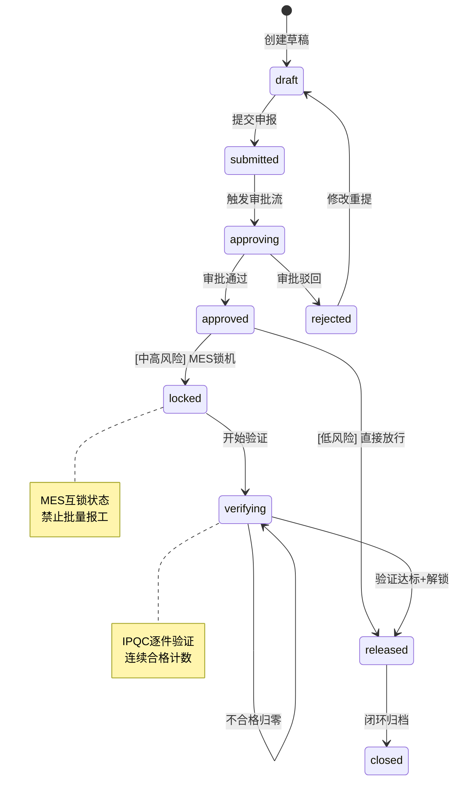
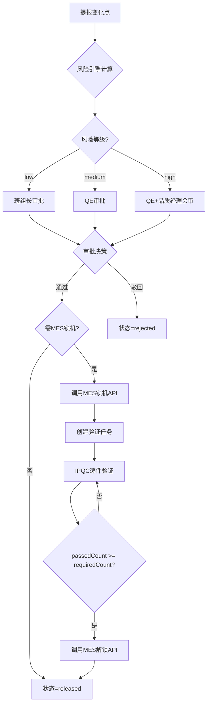
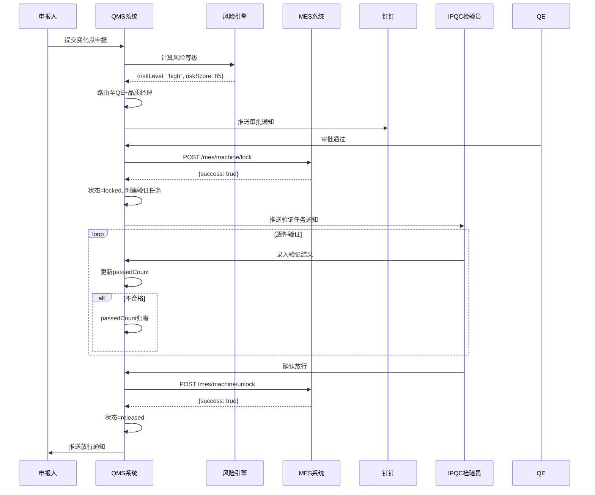

# QMS-TDD-CPM-V4.1 变化点管理详细设计文档（完整版）

**文档编号：** QMS-TDD-CPM-V4.1  
**文档标题：** 变化点管理（Change Point Management）详细设计文档  
**版本：** V4.1  
**状态：** 已批准  
**编制日期：** 2026-03-06  
**所属模块：** 改进与行动 / 变化点管理  
**符合标准：** IATF 16949:2016 §8.5.6 变更控制

---

## 文档修订记录

| 版本 | 日期 | 修订内容 | 修订人 |
|------|------|----------|--------|
| V1.0 | 2026-03-05 | 初始版本，完成基础架构设计 | 系统架构师 |
| V2.0 | 2026-03-06 | 补充风险分析、验证计划 | AI助手 |
| V3.0 | 2026-03-06 | 标准化11章节结构 | AI助手 |
| V4.0 | 2026-03-06 | 使用html-to-prd技能，标准化12章节 | AI助手 |
| **V4.1** | **2026-03-06** | **补充3个缺失的数据表（验证明细、审批日志、风险规则）** | AI助手 |

---

## 1. 模块概述

### 1.1 背景与目标

| 痛点 | 传统方式 | 变化点管理系统 |
|------|----------|----------------|
| **信息孤立** | 变化申报与MES系统割裂，审批通过后无法阻止未验证物料进入批量生产 | 系统自动调用MES锁机API，禁止批量报工 |
| **流程断档** | 中高风险变化缺乏强制验证关卡，凭经验判断放行 | 风险引擎自动定级，中高风险强制触发试生产验证 |
| **预警滞后** | 机台被绕开（盲动报工）时无实时监控 | MES回调实时监控，30秒内钉钉DING通知管理层 |
| **知识流失** | 处理案例分散，无法形成质量知识库 | 闭环后自动沉淀至经验库，触发文件升版 |

**核心目标：** 建立**结构化提报→智能风险定级→分层审批路由→MES互锁防呆→强制试产验证→知识闭环**六位一体的变化点数字化管控体系。

### 1.2 模块范围

| 端 | 功能范围 | 实现状态 |
|---|---|:---:|
| **PC端（核心）** | 台账列表、申报编辑、审批决策、验证任务中心、中央看板、风险矩阵配置 | ✅ 已实现UI |
| **PDA移动端** | 现场一键申报、验证任务录入、班组长快速审批 | ⏳ 待实现 |
| **后端服务** | RESTful API、业务逻辑、数据持久化 | ⏳ 待开发 |
| **MES集成** | 锁机/解锁接口、盲动报工回调 | ⏳ 前端已模拟 |
| **钉钉推送** | 审批通知、预警推送 | ⏳ 待集成 |

---

## 2. 核心业务流程

### 2.1 全流程状态机



### 2.2 核心流转规则



### 2.3 系统交互与时序



---

## 3. 数据模型设计（完整版 - 10张表）

### 3.1 主表：cp_record（变化点处理单）

| 字段名 | 类型 | 必填 | 默认值 | 描述 |
|--------|------|:----:|--------|------|
| `id` | VARCHAR(36) | Y | UUID | **主键** |
| `record_no` | VARCHAR(50) | Y | - | 单号，格式：CPR-YYYYMMDD-NNN，**唯一索引** |
| `title` | VARCHAR(200) | Y | - | 变化点标题 |
| `org_id` | VARCHAR(36) | N | - | 组织ID（多工厂支持） |
| `risk_level` | VARCHAR(10) | Y | - | 风险等级：`low` / `medium` / `high` |
| `risk_score` | INT | N | - | 风险得分（1-100） |
| `risk_description` | TEXT | N | - | 风险评估说明 |
| `status` | VARCHAR(20) | Y | `draft` | 状态（见状态机） |
| `reporter_id` | VARCHAR(36) | Y | - | 提报人ID |
| `reporter_name` | VARCHAR(50) | Y | - | 提报人姓名（冗余） |
| `reporter_dept` | VARCHAR(100) | N | - | 提报人部门 |
| `report_time` | DATETIME | Y | NOW() | 提报时间 |
| `approver_id` | VARCHAR(36) | N | - | 最终审批人ID |
| `approve_time` | DATETIME | N | - | 审批完成时间 |
| `approve_comment` | TEXT | N | - | 审批意见 |
| `mes_lock_time` | DATETIME | N | - | MES锁机时间 |
| `mes_unlock_time` | DATETIME | N | - | MES解锁时间 |
| `verification_plan_id` | VARCHAR(36) | N | - | 关联验证任务ID（**外键**） |
| `closed_by` | VARCHAR(36) | N | - | 闭环操作人ID |
| `close_time` | DATETIME | N | - | 闭环时间 |
| `close_comment` | TEXT | N | - | 闭环说明 |
| `saved_to_knowledge` | BOOLEAN | Y | FALSE | 是否沉淀至知识库 |
| `create_time` | DATETIME | Y | NOW() | 创建时间 |
| `update_time` | DATETIME | Y | NOW() | 更新时间 |
| `version` | INT | Y | 0 | 乐观锁版本号 |

**索引设计：**
- 主键索引：`id`
- 唯一索引：`record_no`
- 复合索引：`(status, report_time)` - 列表查询优化
- 单列索引：`reporter_id`, `risk_level`

---

### 3.2 子表：cp_change_detail（变化明细）

| 字段名 | 类型 | 必填 | 描述 |
|--------|------|:----:|------|
| `id` | VARCHAR(36) | Y | **主键** |
| `record_id` | VARCHAR(36) | Y | **外键** → cp_record.id |
| `change_type` | VARCHAR(20) | Y | 4M1E类型：`man`/`machine`/`material`/`method`/`environment`/`measure`/`other` |
| `change_sub_type` | VARCHAR(50) | Y | 子类型（如"设备大修"、"模具更换"、"供应商切换"） |
| `change_description` | TEXT | Y | 详细变化描述 |
| `affected_product` | VARCHAR(100) | N | 受影响产品编号或名称 |
| `affected_process` | VARCHAR(100) | N | 受影响工序名称 |
| `affected_machine` | VARCHAR(100) | N | 受影响机台编号 |
| `affected_material` | VARCHAR(100) | N | 受影响物料编号 |
| `before_state` | TEXT | N | 变化前状态描述（对比性记录） |
| `after_state` | TEXT | N | 变化后状态描述 |

**索引设计：**
- 主键索引：`id`
- 外键索引：`record_id`

---

### 3.3 验证任务表：cp_verification_plan

| 字段名 | 类型 | 必填 | 默认值 | 描述 |
|--------|------|:----:|--------|------|
| `id` | VARCHAR(36) | Y | UUID | **主键** |
| `record_id` | VARCHAR(36) | Y | - | **外键** → cp_record.id（一对一） |
| `plan_title` | VARCHAR(200) | Y | - | 验证方案标题（如"MC-02换模后首件验证"） |
| `required_count` | INT | Y | - | 要求连续合格件数 |
| `completed_count` | INT | Y | 0 | 已验证件数 |
| `passed_count` | INT | Y | 0 | 当前连续合格计数 |
| `consecutive_fail_count` | INT | Y | 0 | 连续失败计数 |
| `verifier_id` | VARCHAR(36) | Y | - | IPQC责任人ID |
| `verifier_name` | VARCHAR(50) | Y | - | IPQC责任人姓名（冗余） |
| `qe_approver_id` | VARCHAR(36) | N | - | QE确认人ID（验证完成后由QE最终确认） |
| `deadline` | DATETIME | Y | - | 截止时间（自锁机时间起+alert_timeout_hours） |
| `status` | VARCHAR(20) | Y | `pending` | 状态：`pending`/`running`/`passed`/`failed` |
| `create_time` | DATETIME | Y | NOW() | 创建时间 |
| `update_time` | DATETIME | Y | NOW() | 更新时间 |

**索引设计：**
- 主键索引：`id`
- 外键索引：`record_id`（唯一索引，一对一关系）
- 复合索引：`(status, deadline)` - 超时扫描优化

**业务约束：**
- passed_count 达到 required_count 时，才允许点击"确认放行"
- 出现不合格时，passed_count 必须归零

---

### 3.4 单件验证记录表：cp_verification_item（新增）

| 字段名 | 类型 | 必填 | 默认值 | 描述 |
|--------|------|:----:|--------|------|
| `id` | VARCHAR(36) | Y | UUID | **主键** |
| `plan_id` | VARCHAR(36) | Y | - | **外键** → cp_verification_plan.id |
| `sequence` | INT | Y | - | 批次序号（第几件，从1开始递增） |
| `inspector_id` | VARCHAR(36) | Y | - | 检验员ID |
| `inspector_name` | VARCHAR(50) | Y | - | 检验员姓名（冗余） |
| `inspect_time` | DATETIME | Y | NOW() | 检验时间 |
| `result` | VARCHAR(10) | Y | `pending` | 检验结果：`pass`/`fail`/`pending` |
| `note` | TEXT | N | - | 不合格描述或备注说明 |
| `attachments` | JSON | N | - | 现场照片附件路径列表 |

**索引设计：**
- 主键索引：`id`
- 外键索引：`plan_id`
- 唯一索引：`(plan_id, sequence)` - 防止重复序号

**业务约束：**
- 同一验证方案下，sequence必须连续且唯一（1, 2, 3...）
- result为fail时，note字段必填
- attachments格式：`["/uploads/2026/03/photo1.jpg", "/uploads/2026/03/photo2.jpg"]`

---

### 3.5 审批流记录表：cp_approval_log（新增）

| 字段名 | 类型 | 必填 | 默认值 | 描述 |
|--------|------|:----:|--------|------|
| `id` | VARCHAR(36) | Y | UUID | **主键** |
| `record_id` | VARCHAR(36) | Y | - | **外键** → cp_record.id |
| `sequence` | INT | Y | - | 审批顺序序号（从1开始） |
| `approver_id` | VARCHAR(36) | Y | - | 审批人ID |
| `approver_name` | VARCHAR(50) | Y | - | 审批人姓名（冗余） |
| `approver_role` | VARCHAR(50) | Y | - | 审批角色（如：班组长、QE、品质经理） |
| `action` | VARCHAR(20) | Y | `pending` | 操作：`approve`/`reject`/`pending` |
| `comment` | TEXT | N | - | 审批意见或驳回原因 |
| `action_time` | DATETIME | N | - | 审批操作时间 |
| `delegate_from` | VARCHAR(36) | N | - | 代理来源人ID（如适用） |
| `delegate_to` | VARCHAR(36) | N | - | 代理目标人ID（如适用） |
| `create_time` | DATETIME | Y | NOW() | 创建时间 |

**索引设计：**
- 主键索引：`id`
- 外键索引：`record_id`
- 复合索引：`(record_id, sequence)` - 按顺序查询审批历史

**审批角色枚举：**
- `team_leader` - 班组长
- `qe` - 品质工程师
- `quality_manager` - 品质经理
- `quality_director` - 品质总监
- `production_director` - 生产总监

**业务逻辑：**
- 每个变化点可有多条审批记录（会审场景）
- action为reject时，comment必填
- delegate_from/to用于记录代理审批场景（如请假期间委托）

---

### 3.6 风险矩阵规则表：cp_risk_matrix_rule（新增 - 核心引擎配置）

| 字段名 | 类型 | 必填 | 默认值 | 描述 |
|--------|------|:----:|--------|------|
| `id` | VARCHAR(36) | Y | UUID | **主键** |
| `rule_code` | VARCHAR(50) | Y | - | 规则编码（如RULE-MACHINE-001），**唯一索引** |
| `rule_name` | VARCHAR(100) | Y | - | 规则名称（如"设备大修-高风险规则"） |
| `change_type` | VARCHAR(20) | Y | - | 匹配的4M1E大类 |
| `sub_type` | VARCHAR(50) | N | - | 匹配的子类（为空则通配该大类所有子类） |
| `keywords` | VARCHAR(500) | N | - | 关键词列表（逗号分隔），用于扫描描述文本 |
| `default_risk_level` | VARCHAR(10) | Y | - | 匹配后赋予的默认风险等级：`low`/`medium`/`high` |
| `risk_score_base` | INT | N | 50 | 基础风险得分（1-100） |
| `risk_score_formula` | VARCHAR(200) | N | - | 动态计算公式（如：`base + keyword_count * 5`） |
| `require_qe_approval` | BOOLEAN | Y | FALSE | 是否需要QE审批 |
| `require_director_approval` | BOOLEAN | Y | FALSE | 是否需要品质经理/总监审批 |
| `require_mes_lock` | BOOLEAN | Y | FALSE | **关键字段**：审批通过后是否强制触发MES互锁 |
| `required_trial_count` | INT | N | 3 | 若需MES互锁，试生产要求连续合格件数 |
| `alert_timeout_hours` | INT | N | 4 | 锁机后验证超时告警阈值（小时） |
| `description` | TEXT | N | - | 该规则的业务说明 |
| `is_active` | BOOLEAN | Y | TRUE | 是否启用该规则 |
| `sort_order` | INT | Y | 99 | 规则匹配优先级（越小越优先） |
| `effective_date` | DATE | N | - | 生效日期（为空则立即生效） |
| `expiry_date` | DATE | N | - | 失效日期（为空则永久有效） |
| `created_by` | VARCHAR(36) | Y | - | 创建人ID |
| `create_time` | DATETIME | Y | NOW() | 创建时间 |
| `update_time` | DATETIME | Y | NOW() | 更新时间 |

**索引设计：**
- 主键索引：`id`
- 唯一索引：`rule_code`
- 复合索引：`(change_type, sub_type, is_active)` - 规则匹配查询优化
- 单列索引：`sort_order`, `is_active`, `effective_date`, `expiry_date`

**引擎匹配逻辑（关键）：**
```
1. 加载规则：WHERE is_active=true AND (effective_date IS NULL OR effective_date <= NOW())
           AND (expiry_date IS NULL OR expiry_date > NOW())
           ORDER BY sort_order ASC

2. 三轮匹配：
   - 精确匹配：change_type + sub_type 完全一致
   - 大类通配：change_type一致，sub_type为空
   - 关键词匹配：keywords中的任一关键词出现在description中

3. 聚合策略：
   - 取所有命中规则中的最高风险级（high > medium > low）
   - require_mes_lock、require_qe_approval、require_director_approval 采用逻辑"OR并集"
   - 取sort_order最小的规则作为"代表规则"（用于获取required_trial_count等参数）

4. 兜底策略：
   - 若无任何规则命中 → 返回 {riskLevel: "low", riskScore: 30}
```

**示例规则数据：**
```sql
-- 规则1：设备大修 - 高风险
INSERT INTO cp_risk_matrix_rule VALUES (
  'r1', 'RULE-MACHINE-001', '设备大修-高风险', 'machine', '设备大修',
  '大修,停机,拆解', 'high', 85, NULL,
  TRUE, TRUE, TRUE, 3, 4,
  '关键设备大修必须经过总监审批，并强制MES互锁验证',
  TRUE, 1, NULL, NULL, 'admin', NOW(), NOW()
);

-- 规则2：模具更换 - 中风险
INSERT INTO cp_risk_matrix_rule VALUES (
  'r2', 'RULE-MACHINE-002', '模具更换-中风险', 'machine', '模具更换',
  '换模,模具,更换', 'medium', 60, NULL,
  TRUE, FALSE, TRUE, 3, 4,
  '模具更换需要QE审批，并强制首件验证',
  TRUE, 2, NULL, NULL, 'admin', NOW(), NOW()
);

-- 规则3：新员工上岗 - 低风险
INSERT INTO cp_risk_matrix_rule VALUES (
  'r3', 'RULE-MAN-001', '新员工上岗-低风险', 'man', '新员工上岗',
  '新员工,上岗,入职', 'low', 30, NULL,
  FALSE, FALSE, FALSE, NULL, NULL,
  '新员工上岗班组长审批即可，无需MES互锁',
  TRUE, 3, NULL, NULL, 'admin', NOW(), NOW()
);
```

---

### 3.7 MES互锁日志表：cp_mes_lock_log

| 字段名 | 类型 | 必填 | 描述 |
|--------|------|:----:|------|
| `id` | VARCHAR(36) | Y | **主键** |
| `record_id` | VARCHAR(36) | Y | **外键** → cp_record.id |
| `action` | VARCHAR(20) | Y | 操作：`lock`/`unlock`/`violation`（盲动报工告警） |
| `machine_no` | VARCHAR(50) | N | 受控机台编号 |
| `work_order_id` | VARCHAR(50) | N | 受控工单号（如按工单锁定） |
| `operator_id` | VARCHAR(36) | N | 操作发起人（系统自动触发时为系统账号） |
| `operation_time` | DATETIME | Y | 操作执行时间 |
| `mes_response_code` | VARCHAR(20) | N | MES接口响应状态码 |
| `result` | VARCHAR(10) | Y | 执行结果：`success`/`fail` |
| `note` | TEXT | N | 备注说明（如失败原因、盲动报工的报工单号） |

**索引设计：**
- 主键索引：`id`
- 外键索引：`record_id`
- 复合索引：`(record_id, action)` - 按单号查询锁机/解锁记录

**业务场景：**
- `lock` - 审批通过后自动触发MES锁机
- `unlock` - 验证通过后自动触发MES解锁
- `violation` - MES回调通知机台在锁定期间出现批量报工（盲动）

---

### 3.8 预警通知表：cp_alert_record

| 字段名 | 类型 | 必填 | 描述 |
|--------|------|:----:|------|
| `id` | VARCHAR(36) | Y | **主键** |
| `record_id` | VARCHAR(36) | Y | **外键** → cp_record.id |
| `record_no` | VARCHAR(50) | Y | 冗余单号（避免JOIN查询） |
| `alert_type` | VARCHAR(30) | Y | 预警类型：`blind_move`/`verification_timeout` |
| `severity` | VARCHAR(10) | Y | 严重等级：`red`/`orange` |
| `message` | TEXT | Y | 预警消息正文 |
| `trigger_time` | DATETIME | Y | 触发时间 |
| `notified_users` | JSON | N | 已推送通知的用户ID列表 |
| `is_read` | BOOLEAN | Y | 是否已被确认/处理 |
| `read_by` | VARCHAR(36) | N | 确认人ID |
| `read_time` | DATETIME | N | 确认时间 |

**索引设计：**
- 主键索引：`id`
- 外键索引：`record_id`
- 复合索引：`(severity, is_read)` - 未读预警查询

**预警类型说明：**
- `blind_move`（盲动报工）- 🔴 红色预警，30秒内推送至生产总监和品质总监
- `verification_timeout`（验证超时）- 🟠 橙色预警，推送给验证责任人和QE

---

### 3.9 文件升版关联表：cp_document_update

| 字段名 | 类型 | 必填 | 描述 |
|--------|------|:----:|------|
| `id` | VARCHAR(36) | Y | **主键** |
| `record_id` | VARCHAR(36) | Y | **外键** → cp_record.id |
| `doc_type` | VARCHAR(20) | Y | 文件类型：`sop`/`cp`/`fmea`/`inspection_standard` |
| `doc_no` | VARCHAR(50) | Y | 文件编号 |
| `doc_name` | VARCHAR(200) | Y | 文件名称 |
| `current_version` | VARCHAR(20) | Y | 当前版本号 |
| `new_version` | VARCHAR(20) | N | 升版后版本号 |
| `update_reason` | TEXT | Y | 升版原因（关联到变化点内容） |
| `status` | VARCHAR(20) | Y | 状态：`pending`/`in_progress`/`completed` |
| `responsible_id` | VARCHAR(36) | Y | 责任人ID（技术部/品质部） |
| `responsible_name` | VARCHAR(50) | Y | 责任人姓名 |
| `plan_complete_date` | DATE | N | 计划完成日期 |
| `actual_complete_date` | DATE | N | 实际完成日期 |
| `create_time` | DATETIME | Y | 创建时间 |

**索引设计：**
- 主键索引：`id`
- 外键索引：`record_id`
- 单列索引：`status`, `responsible_id`

**业务逻辑：**
- 闭环时勾选"触发文件升版" → 自动创建记录
- 文件类型支持：SOP（作业指导书）、CP（控制计划）、FMEA（失效模式分析）
- 技术部门在QMS外完成升版后，回填actual_complete_date

---

### 3.10 知识库沉淀表：cp_knowledge_base

| 字段名 | 类型 | 必填 | 描述 |
|--------|------|:----:|------|
| `id` | VARCHAR(36) | Y | **主键** |
| `record_id` | VARCHAR(36) | Y | **外键** → cp_record.id |
| `knowledge_type` | VARCHAR(30) | Y | 知识类型：`case_study`/`lesson_learned`/`best_practice` |
| `title` | VARCHAR(200) | Y | 知识标题 |
| `summary` | TEXT | Y | 案例摘要（300字以内） |
| `keywords` | VARCHAR(500) | Y | 关键词（逗号分隔，用于检索） |
| `risk_level` | VARCHAR(10) | Y | 风险等级（冗余，便于筛选） |
| `change_type` | VARCHAR(20) | Y | 4M1E类型（冗余） |
| `solution` | TEXT | N | 处理方案 |
| `verification_method` | TEXT | N | 验证方法 |
| `effectiveness` | VARCHAR(200) | N | 效果评价 |
| `view_count` | INT | Y | 0 | 查看次数 |
| `useful_count` | INT | Y | 0 | 有用次数（点赞） |
| `created_by` | VARCHAR(36) | Y | 创建人ID |
| `create_time` | DATETIME | Y | 创建时间 |
| `publish_time` | DATETIME | N | 发布时间（审核通过后） |
| `status` | VARCHAR(20) | Y | 状态：`draft`/`published`/`archived` |

**索引设计：**
- 主键索引：`id`
- 外键索引：`record_id`（唯一索引，一对一）
- 全文索引：`keywords` - 支持关键词搜索
- 复合索引：`(change_type, risk_level, status)` - 分类查询

**业务逻辑：**
- 闭环时自动生成草稿记录（status=draft）
- QE审核后发布（status=published）
- 支持全文检索：通过关键词匹配历史相似案例

---

## 4. 业务触发机制详细说明

### 4.1 风险定级引擎（Risk Engine）

**触发时机：** 用户提交变化点申报时（点击"提交申报"按钮）

**执行步骤（伪代码）：**
```
ON_SUBMIT(changePoint):
  // 1. 加载活跃规则
  rules = SELECT * FROM cp_risk_matrix_rule 
          WHERE is_active = TRUE 
          AND (effective_date IS NULL OR effective_date <= NOW())
          AND (expiry_date IS NULL OR expiry_date > NOW())
          ORDER BY sort_order ASC
  
  matched_rules = []
  
  // 2. 三轮匹配
  FOR EACH rule IN rules:
    // 精确匹配
    IF rule.change_type == changePoint.change_type THEN
      IF rule.sub_type == NULL OR rule.sub_type == changePoint.sub_type THEN
        matched_rules.add(rule)
      END IF
    END IF
    
    // 关键词匹配
    IF rule.keywords IN changePoint.description THEN
      matched_rules.add(rule)
    END IF
  END FOR
  
  // 3. 聚合结果
  IF matched_rules.isEmpty() THEN
    RETURN {riskLevel: "low", riskScore: 30}  // 兜底策略
  ELSE
    highest_risk = MAX(matched_rules.risk_level)  // high>medium>low
    primary_rule = MIN(matched_rules.sort_order)
    
    // 动态计算得分
    risk_score = primary_rule.risk_score_base
    IF primary_rule.risk_score_formula EXISTS THEN
      keyword_count = COUNT_KEYWORDS(primary_rule.keywords, changePoint.description)
      risk_score = EVAL(primary_rule.risk_score_formula)
    END IF
    
    RETURN {
      riskLevel: highest_risk,
      riskScore: risk_score,
      ruleId: primary_rule.id,
      requireMesLock: ANY(matched_rules.require_mes_lock),
      requireQeApproval: ANY(matched_rules.require_qe_approval),
      requireDirectorApproval: ANY(matched_rules.require_director_approval)
    }
  END IF
```

### 4.2 MES锁机触发（Lock Trigger）

**触发条件：** 审批通过且风险等级为 medium/high

**执行步骤（伪代码）：**
```
ON_APPROVE(record):
  IF record.risk_level IN ["medium", "high"] THEN
    TRY:
      // 1. 调用MES锁机API
      response = MES_CLIENT.lockMachine(
        machineNo: record.affected_machine,
        workOrderId: record.affected_work_order,
        reason: "变化点审批通过，需试生产验证",
        lockId: generateUUID(),
        lockTime: NOW()
      )
      
      // 2. 记录MES日志
      INSERT INTO cp_mes_lock_log (
        record_id: record.id,
        action: "lock",
        machine_no: record.affected_machine,
        operator_id: SYSTEM_USER_ID,
        operation_time: NOW(),
        mes_response_code: response.code,
        result: response.success ? "success" : "fail"
      )
      
      IF response.success THEN
        // 3. 更新单据状态
        UPDATE record SET 
          status = "locked",
          mes_lock_time = NOW()
        
        // 4. 创建验证任务
        rule = GET_RULE(record.rule_id)
        INSERT INTO cp_verification_plan (
          record_id: record.id,
          plan_title: record.title + " - 试生产验证",
          required_count: rule.required_trial_count,
          verifier_id: AUTO_ASSIGN_IPQC(record.affected_process),
          deadline: NOW() + rule.alert_timeout_hours,
          status: "pending"
        )
        
        // 5. 推送通知
        DINGTALK.notify(verifier_id, "新的验证任务待处理")
        WEBSOCKET.push("new_verification_task", plan)
        
      ELSE
        // MES接口失败，触发告警
        ALERT_ADMIN("MES锁机失败：" + response.error)
        ROLLBACK  // 不更新单据状态
      END IF
      
    CATCH timeout:
      RETRY(3次, 间隔1s/2s/5s)
      IF all_failed THEN
        ALERT_ADMIN("MES接口超时，请人工干预")
      END IF
  ELSE
    // 低风险直接放行
    UPDATE record SET status = "released"
  END IF
```

### 4.3 单件验证录入逻辑

**触发条件：** IPQC在验证任务中心点击"录入结果"

**执行步骤（伪代码）：**
```
ON_SUBMIT_VERIFICATION_ITEM(planId, result, note):
  plan = SELECT * FROM cp_verification_plan WHERE id = planId
  
  // 1. 校验前置条件
  IF plan.status NOT IN ["pending", "running"] THEN
    THROW "任务已完成或失败，无法继续录入"
  END IF
  
  // 2. 创建验证记录
  sequence = plan.completed_count + 1
  INSERT INTO cp_verification_item (
    plan_id: planId,
    sequence: sequence,
    inspector_id: CURRENT_USER_ID,
    inspect_time: NOW(),
    result: result,
    note: note
  )
  
  // 3. 更新验证计划统计
  IF result == "pass" THEN
    plan.passed_count = plan.passed_count + 1
    plan.consecutive_fail_count = 0
    plan.status = "running"
    MESSAGE = "✅ 第" + sequence + "件验证合格"
  ELSE
    plan.passed_count = 0  // 归零
    plan.consecutive_fail_count = plan.consecutive_fail_count + 1
    plan.status = "running"
    MESSAGE = "❌ 第" + sequence + "件不合格！连续合格计数已归零"
    
    // 连续失败3次自动中止
    IF plan.consecutive_fail_count >= 3 THEN
      plan.status = "failed"
      ALERT_QE("验证连续失败3次，任务已自动中止")
    END IF
  END IF
  
  plan.completed_count = plan.completed_count + 1
  UPDATE plan
  
  // 4. 检查是否达标
  IF plan.passed_count >= plan.required_count THEN
    MESSAGE += "\n🎉 验证达标！可以确认放行"
    SHOW_BUTTON("确认放行")
  END IF
  
  RETURN {message: MESSAGE, plan: plan}
```

### 4.4 盲动报工预警（Blind Move Alert）

**触发条件：** MES系统回调通知机台在锁定期间出现批量报工

**执行步骤（伪代码）：**
```
ON_MES_VIOLATION(machineNo, workOrderId, quantity, reportTime):
  // 1. 查询该机台是否有锁定中的变化点
  record = SELECT * FROM cp_record 
           WHERE affected_machine = machineNo 
           AND status IN ["locked", "verifying"]
           ORDER BY mes_lock_time DESC
           LIMIT 1
  
  IF record EXISTS THEN
    // 2. 记录违规日志
    INSERT INTO cp_mes_lock_log (
      record_id: record.id,
      action: "violation",
      machine_no: machineNo,
      work_order_id: workOrderId,
      operation_time: NOW(),
      note: "盲动报工，数量：" + quantity + "，时间：" + reportTime
    )
    
    // 3. 生成红色预警
    INSERT INTO cp_alert_record (
      record_id: record.id,
      record_no: record.record_no,
      alert_type: "blind_move",
      severity: "red",
      message: "🚨 盲动报工！机台" + machineNo + "在锁定期间报工" + quantity + "件，请立即核查！",
      trigger_time: NOW(),
      is_read: FALSE
    )
    
    // 4. 钉钉DING消息（高优先级）
    DINGTALK.sendDING(
      userIds: [PRODUCTION_DIRECTOR_ID, QUALITY_DIRECTOR_ID],
      message: "🚨【红色预警】机台" + machineNo + "盲动报工，请立即核查！",
      priority: "high"
    )
    
    // 5. WebSocket实时推送至看板
    WEBSOCKET.broadcast("alert", alertRecord)
    
  ELSE
    // 机台未锁定，忽略（正常报工）
    LOG("机台" + machineNo + "未锁定，正常报工")
  END IF
```

### 4.5 验证超时预警（Timeout Alert）

**触发条件：** 定时任务每15分钟扫描一次

**Cron表达式：** `*/15 * * * *`

**执行步骤（伪代码）：**
```
CRON_EVERY_15_MIN():
  plans = SELECT * FROM cp_verification_plan 
          WHERE status = "running" 
          AND deadline < NOW()
  
  FOR EACH plan IN plans:
    // 检查是否已发送过超时预警（防止重复）
    existing_alert = SELECT * FROM cp_alert_record 
                     WHERE record_id = plan.record_id 
                     AND alert_type = "verification_timeout"
                     AND trigger_time > plan.deadline
    
    IF existing_alert NOT EXISTS THEN
      // 计算超时时长
      hours_diff = (NOW() - plan.deadline) / 3600
      
      // 生成橙色预警
      INSERT INTO cp_alert_record (
        record_id: plan.record_id,
        record_no: plan.record_no,
        alert_type: "verification_timeout",
        severity: "orange",
        message: "⏰ 验证超时！变化点" + plan.record_no + "已超时" + hours_diff + "小时，请尽快处理",
        trigger_time: NOW(),
        is_read: FALSE
      )
      
      // 推送催办通知
      DINGTALK.notify(
        userIds: [plan.verifier_id, plan.qe_approver_id],
        message: "⏰【超时提醒】验证任务已超时" + hours_diff + "小时，请尽快处理"
      )
      
      // WebSocket推送
      WEBSOCKET.broadcast("alert", alertRecord)
    END IF
  END FOR
```

---

## 5. 核心功能/页面详细设计

### 5.1 变化点申报编辑页面（PC端）

#### 页面布局设计（ASCII）

```
┌────────────────────────────────────────────────────────────────────┐
│  [← 返回台账列表]  提交申报  暂存草稿              [状态标签][风险标签] │
├───────────────────────────────────────────┬────────────────────────┤
│                                           │  处理进度（垂直步骤条） │
│  📋 基本信息                              │  ├─ 草稿 ✓             │
│  ┌──────────────────────────────────────┐│  ├─ 提报审批 ✓         │
│  │ 单号: (系统自动生成)                  ││  ├─ 审批通过           │
│  │ 标题: [___________________________]  ││  ├─ 试产验证           │
│  │ 提报人: 当前用户                      ││  ├─ 放行解锁           │
│  └──────────────────────────────────────┘│  └─ 闭环归档            │
│                                           │                        │
│  🏷️ 4M1E变化分类                          │  🔒 MES互锁状态        │
│  ┌─────┬─────┬─────┬─────┬─────┬─────┐  │  ┌────────────────────┐│
│  │ 👷人 │ 🏭机 │ 📦料 │ 📋法 │ 🌡️环 │ 📐测 │  │  │ 机台锁定中          ││
│  └─────┴─────┴─────┴─────┴─────┴─────┘  │  │ 锁机时间: 10:30    ││
│  子类型: [设备大修 ▼]                     │  │ 验证进度: 2/3      ││
│  受影响机台: [MC-02_______________]       │  └────────────────────┘│
│  受影响产品: [产品型号ABC____________]    │                        │
│                                           │  ✍️ 审批意见            │
│  详细描述:                                │  ┌────────────────────┐│
│  ┌──────────────────────────────────────┐│  │ 王QE · 10:25       ││
│  │ 压铸模具A长期使用老化，本次更换...   ││  │ "同意批准，请按要  ││
│  │                                      ││  │ 求验证后放行"      ││
│  └──────────────────────────────────────┘│  └────────────────────┘│
│                                           │                        │
│  ⚠️ 风险评估                              │                        │
│  ┌──────────────┬──────────────────────┐ │                        │
│  │   🔴 高风险   │  风险分析补充:       │ │                        │
│  │   得分: 85   │  ┌──────────────────┐│ │                        │
│  │ 总监审批+锁机│  │ 模具更换可能影响 ││ │                        │
│  └──────────────┤  │ 尺寸精度...      ││ │                        │
│                 │  └──────────────────┘│ │                        │
│                 └──────────────────────┘ │                        │
│                                           │                        │
│  📎 附件上传                              │                        │
│  ┌──────────────────────────────────────┐│                        │
│  │  拖拽文件至此区域上传                ││                        │
│  │  支持图片、文档                      ││                        │
│  └──────────────────────────────────────┘│                        │
└───────────────────────────────────────────┴────────────────────────┘
```

#### 核心交互逻辑

| 场景 | 系统响应/约束 |
|------|--------------|
| 选择4M1E类型 | 自动加载对应子类型下拉选项（如machine→["设备大修", "模具更换"]） |
| 输入描述文本 | 实时调用风险引擎预览API，动态显示风险等级预览 |
| 点击"提交申报" | 触发风险引擎正式计算，保存记录，状态流转为submitted |
| 点击"暂存草稿" | 保存当前数据，状态保持draft，不触发风险引擎 |
| 审批人查看详情 | 审批按钮仅在status=approving时显示 |
| 闭环操作 | 弹窗询问是否触发文件升版，勾选后提示技术部门 |

---

### 5.2 验证任务中心页面（PC端）

#### 页面布局设计（ASCII）

```
┌────────────────────────────────────────────────────────────────────┐
│  试生产验证任务中心                    [导出] [刷新]              │
├────────────────────────────────────────────────────────────────────┤
│  📊 统计摘要                                                       │
│  ┌──────┬──────┬──────┬──────┐                                   │
│  │🕐待开始│🔄验证中│⏰已超时│✅已放行│                                   │
│  │  3   │  2   │  1   │  12  │                                   │
│  └──────┴──────┴──────┴──────┘                                   │
├────────────────────────────────────────────────────────────────────┤
│  搜索: [关键字______] 状态: [全部 ▼] [查询] [重置]               │
├────────────────────────────────────────────────────────────────────┤
│  验证任务列表                                                      │
│  ┌──────────┬────────────────┬────────┬──────────┬────────┬──────┐│
│  │ 关联单号  │ 验证方案标题    │  状态  │ 验证进度 │ 截止时间│ 操作 ││
│  ├──────────┼────────────────┼────────┼──────────┼────────┼──────┤│
│  │CPR-001  │MC-02换模验证   │ 验证中 │ ████░2/3 │ -1h超时│ 办理 ││
│  │CPR-004  │新量具比对验证  │ 已通过 │ █████5/5 │ 完成  │ 查看 ││
│  └──────────┴────────────────┴────────┴──────────┴────────┴──────┘│
│                                                                      │
│  ┌─────────────────────── 详情视图（点击"办理"后展示）─────────────┐│
│  │  [← 返回列表] CPR-001 · 试生产验证任务                        ││
│  │  ┌──────────────────────────────────────────────────────────┐ ││
│  │  │  MC-02换模后首件验证（连续3件合格）                       │ ││
│  │  │  关联单号: CPR-001  验证人: 赵IPQC  QE: 王QE             │ ││
│  │  └──────────────────────────────────────────────────────────┘ ││
│  │                                                                ││
│  │  ┌────┬────┬────┬────┐  [✅ 确认放行]                        ││
│  │  │要求│已验│连续│剩余│                                        ││
│  │  │ 3 │ 2 │ 2 │1h │                                        ││
│  │  └────┴────┴────┴────┘                                        ││
│  │                                                                ││
│  │  验证明细记录                                                  ││
│  │  ┌──┬──────┬────────┬──────┬──────┐                         ││
│  │  │序号│检验人│检验时间│ 结果 │ 操作 │                         ││
│  │  ├──┼──────┼────────┼──────┼──────┤                         ││
│  │  │ 1 │赵IPQC│10:00  │ ✅合格│[录入]│                         ││
│  │  │ 2 │赵IPQC│10:15  │ ✅合格│[录入]│                         ││
│  │  │ 3 │      │       │ 待检 │[录入]│                         ││
│  │  └──┴──────┴────────┴──────┴──────┘                         ││
│  └────────────────────────────────────────────────────────────────┘│
└────────────────────────────────────────────────────────────────────┘
```

#### 核心交互逻辑

| 场景 | 系统响应 |
|------|----------|
| passedCount >= requiredCount | 在详情页顶部展示**绿色成功告警框**，出现"✅ 确认放行"按钮 |
| 验证件出现fail结果 | passedCount归零，展示**红色危险告警框**，给出"重新开始验证"按钮 |
| 当前时间超过deadline | 截止时间列以红色高亮显示，并在详情页内展示超时警示 |
| 状态为passed（已完成放行） | 只读展示，进度条为绿色100%，不允许继续录入 |

---

## 6. 前端组件规划

| 组件文件 | 功能描述 |
|----------|----------|
| `ChangePointList.vue` | 台账列表页：状态Tab切换、搜索筛选、数据表格、审批弹窗、MES日志查看 |
| `ChangePointEdit.vue` | 申报/编辑/查看详情页：4M1E选择器、风险评估卡片、附件上传、工作流进度条 |
| `VerificationCenter.vue` | 验证任务中心：任务列表、详情视图（全屏）、单件录入弹窗、放行确认 |
| `ChangePointDashboard.vue` | 中央看板：统计卡片、ECharts图表（风险分布、趋势折线）、实时预警列表 |
| `RiskMatrixConfig.vue` | 风险矩阵配置：4M1E分类Tab、规则列表表格、新增/编辑弹窗、启用/停用开关 |
| `ApprovalModal.vue` | 审批决策弹窗：通过/驳回选择、审批意见输入、MES锁机提示 |
| `VerificationItemModal.vue` | 单件验证录入弹窗：合格/不合格选择、备注输入、附件上传 |
| `MesLockTimeline.vue` | MES互锁时间线组件：展示锁机/解锁/违规日志 |
| `VerificationProgressCard.vue` | 验证进度卡片：要求/已验/连续/剩余四格数据展示 |
| `ApprovalHistory.vue` | 审批历史组件：展示审批流记录（时间线形式） |

---

## 7. 后端 API 接口概览

| 方法 | 路径 | 描述 |
|------|------|------|
| POST | `/api/v1/change-point/records` | 创建变化点申报单（触发风险引擎） |
| GET | `/api/v1/change-point/records` | 分页查询变化点台账列表 |
| GET | `/api/v1/change-point/records/:id` | 获取单据详情（含MES日志、验证任务、审批历史） |
| PUT | `/api/v1/change-point/records/:id` | 更新草稿单据内容 |
| POST | `/api/v1/change-point/records/:id/approve` | 审批操作（通过/驳回） |
| POST | `/api/v1/change-point/records/:id/close` | 闭环操作 |
| GET | `/api/v1/change-point/verification-plans` | 查询验证任务列表 |
| GET | `/api/v1/change-point/verification-plans/:id` | 获取验证任务详情（含各件明细） |
| POST | `/api/v1/change-point/verification-plans/:id/items` | 录入单件验证结果 |
| POST | `/api/v1/change-point/verification-plans/:id/release` | 确认放行（触发MES解锁） |
| GET | `/api/v1/change-point/risk-matrix/rules` | 查询风险矩阵规则列表 |
| POST | `/api/v1/change-point/risk-matrix/rules` | 新增规则 |
| PUT | `/api/v1/change-point/risk-matrix/rules/:id` | 更新规则 |
| DELETE | `/api/v1/change-point/risk-matrix/rules/:id` | 删除规则 |
| POST | `/api/v1/change-point/risk-matrix/evaluate` | 实时评估（前端预览风险等级） |
| GET | `/api/v1/change-point/dashboard/stats` | 看板统计数据 |
| GET | `/api/v1/change-point/alerts` | 查询预警通知列表 |
| POST | `/api/v1/webhook/mes-violation` | 接收MES盲动报工回调（Webhook） |
| GET | `/api/v1/change-point/approval-logs/:recordId` | 查询审批流记录（按单号） |

---

## 8. 非功能性要求

| 类别 | 要求 |
|------|------|
| **安全** | 风险矩阵配置页仅超级管理员/QE角色可访问；放行操作需二次确认弹窗；JWT Token认证 + RBAC权限控制 |
| **数据完整性** | MES互锁成功响应后才允许更新单据状态；若MES接口调用失败，记录失败日志并告警，不自动修改状态 |
| **审计追溯** | 所有状态变更、审批操作、MES互锁动作必须完整记录于对应日志表（cp_approval_log、cp_mes_lock_log），永久保留不可删除，符合ALCOA+原则 |
| **容错处理** | MES API调用超时阈值为10秒；若超时，自动重试最多3次（间隔1s/2s/5s）；最终失败后触发站内告警 |
| **性能/实时性** | 盲动报工预警必须在MES回调后30秒内完成推送；验证超时扫描间隔不超过15分钟；列表查询响应时间 < 500ms (P95) |

---

## 9. 非功能性要求（QMS重点关注）

### 9.1 性能要求

| 指标 | 目标值 | 测量方法 |
|------|--------|----------|
| **页面首次加载** | < 2s（首屏） | Lighthouse性能评分 ≥ 80 |
| **API响应时间** | < 500ms（P95） | Prometheus监控 |
| **列表查询** | < 1s（1000条数据） | 数据库慢查询日志 |
| **并发处理** | 支持100 QPS | 压力测试（JMeter） |
| **大数据量导出** | < 30s（10000条） | 手动测试 |

### 9.2 可用性要求

| 指标 | 目标值 | 实现方式 |
|------|--------|----------|
| **系统可用性** | ≥ 99.5% | 负载均衡 + 健康检查 |
| **故障恢复时间** | < 5min | 自动重启 + 告警 |
| **数据备份** | 每日备份，保留30天 | 定时任务 + 异地备份 |
| **灾备切换** | < 15min | 主从切换演练 |

### 9.3 安全性要求

| 安全项 | 要求 | 验证方式 |
|--------|------|----------|
| **身份认证** | JWT Token + 刷新机制 | 安全扫描 |
| **权限控制** | RBAC（基于角色的访问控制） | 权限测试矩阵 |
| **数据加密** | HTTPS传输，敏感字段AES加密 | 抓包分析 |
| **SQL注入防护** | 参数化查询，禁用拼接SQL | OWASP扫描 |
| **XSS防护** | 输入转义，CSP策略 | 安全扫描 |
| **CSRF防护** | Token验证 | 渗透测试 |
| **审计追溯** | 所有操作记录日志，保留3年 | 日志审计 |

### 9.4 可追溯性要求（ALCOA+ 原则）

| 原则 | 要求 | 实现方式 |
|------|------|----------|
| **A - Attributable（可归因）** | 所有操作记录操作人ID、姓名、时间 | cp_approval_log、cp_verification_item等表记录 |
| **L - Legible（清晰可读）** | 数据格式标准化，无歧义 | 使用枚举、标准日期格式 |
| **C - Contemporaneous（同时记录）** | 实时记录，不延迟 | 所有表都有create_time、action_time |
| **O - Original（原始）** | 保留原始数据，不被篡改 | 乐观锁（version字段）、审计日志 |
| **A - Accurate（准确）** | 数据校验机制 | 前端校验 + 后端校验 + 数据库约束 |
| **+ Complete（完整）** | 全流程数据不缺失 | 状态机完整性、必填字段约束 |
| **+ Consistent（一致）** | 前后端数据一致性 | 事务机制、幂等性设计 |
| **+ Enduring（持久）** | 数据长期保存 | 数据库持久化 + 定期备份 |
| **+ Available（可用）** | 数据随时可查询 | 索引优化、缓存机制 |

### 9.5 可维护性要求

| 要求 | 实现方式 |
|------|----------|
| **日志级别** | ERROR（异常）、WARN（超时）、INFO（关键操作）、DEBUG（调试） |
| **监控指标** | Prometheus指标（QPS、响应时间、错误率） |
| **告警规则** | 错误率 > 5%、响应时间 > 1s、MES接口失败 |
| **可视化看板** | Grafana实时监控大盘 |

### 9.6 兼容性要求

| 平台 | 支持范围 |
|------|----------|
| **浏览器** | Chrome 90+, Edge 90+, Safari 14+ |
| **移动端** | iOS 13+, Android 10+ |
| **分辨率** | 1280x720（最小）~ 4K（最佳） |
| **网络** | 支持4G/5G/WiFi，弱网降级提示 |

---

## 10. 风险点、依赖与上下游对接

### 10.1 技术风险

| 风险点 | 严重程度 | 概率 | 应对措施 |
|--------|:--------:|:----:|----------|
| **MES锁机指令失效** | 🔴 高 | 低 | 锁机后强制二次确认；MES回调验证锁机状态；盲动报工立即红色预警 |
| **风险定级不准确** | 🔴 高 | 中 | 关键产品默认提升一级；QE定期审核准确率；引入AI辅助判断（中期） |
| **验证数据造假** | 🔴 高 | 低 | 强制上传现场照片；随机抽查验证记录；连续合格合理性校验 |
| **第三方依赖失败** | 🟡 中 | 中 | 钉钉/MES不可用 → 降级方案（站内信+邮件）；推送失败重试3次 |
| **并发操作冲突** | 🟡 中 | 中 | 数据库行锁；乐观锁（version字段）；前端禁用重复提交 |
| **性能瓶颈** | 🟡 中 | 高 | 复合索引优化；Redis缓存；前端虚拟滚动 |

### 10.2 合规风险

| 法规条款 | 要求 | 缓解方案 |
|----------|------|----------|
| **IATF 16949 §8.5.6** | 变更控制必须经过评审和验证 | 风险引擎自动定级 + 强制验证流程 + 闭环确认 |
| **IATF 16949 §7.5.3** | 文件控制（版本管理） | 闭环时触发文件升版提示，联动SOP/CP/FMEA更新 |
| **IATF 16949 §10.2** | 不合格品控制 | 验证不合格时自动隔离，禁止批量报工 |
| **ALCOA+ 原则** | 数据完整性 | 审计日志完整记录、电子签名、版本控制、防篡改机制 |

### 10.3 外部依赖清单

| 依赖类型 | 名称 | 用途 | 可用性要求 |
|----------|------|------|-----------|
| **外部API** | MES系统 | 锁机/解锁指令、盲动报工回调 | ≥ 99.5% |
| **外部API** | 钉钉开放平台 | 审批通知、预警推送、DING消息 | 降级时使用站内信 |
| **第三方组件** | Ant Design Vue | UI组件库 | 开源，无依赖风险 |
| **中间件** | Redis | 缓存、会话存储 | 主从部署，高可用 |
| **中间件** | RabbitMQ | 异步消息队列 | 集群部署，高可用 |

### 10.4 上下游系统对接矩阵

| 调用方 | 被调用方 | 接口方向 | 数据同步方式 |
|--------|----------|----------|--------------|
| QMS | MES | QMS → MES | 同步REST API（锁机/解锁） |
| MES | QMS | MES → QMS | Webhook回调（盲动报工） |
| QMS | 钉钉 | QMS → 钉钉 | 异步消息队列（通知推送） |
| 统一认证平台 | QMS | 认证平台 → QMS | JWT Token验证 |
| QMS | 文件存储 | QMS → MinIO/OSS | 同步上传（附件） |

---

## 11. 验证与确认计划（QMS强制）

### 11.1 IQ / OQ / PQ 阶段划分要点

**IQ（安装确认）：**
- [ ] 服务器环境配置验证（Java版本、MySQL版本、Redis配置）
- [ ] 数据库表结构创建与索引验证（10张表 + 所有索引）
- [ ] 中间件（Redis、RabbitMQ）连通性测试
- [ ] 外部系统（MES、钉钉）接口连通性测试
- [ ] 风险矩阵规则初始化数据验证

**OQ（运行确认）：**
- [ ] 风险定级引擎准确性测试（100个样本，准确率 ≥ 90%）
- [ ] 状态流转完整性测试（覆盖所有状态转换路径）
- [ ] MES锁机/解锁功能测试（成功/失败/超时场景）
- [ ] 验证归零逻辑测试（不合格归零、连续失败中止）
- [ ] 预警机制测试（盲动报工、验证超时）
- [ ] 并发性能测试（100 QPS，响应时间 < 500ms）
- [ ] 审批流记录完整性测试（多级审批、代理审批）

**PQ（性能确认）：**
- [ ] UAT用户验收测试（2周，3个工厂）
- [ ] 真实生产环境试运行（1个月）
- [ ] 关键指标达成验证（SLA ≥ 99.5%，响应时间 < 500ms）

### 11.2 关键测试场景清单

| 测试场景 | 测试用例 | 预期结果 | 优先级 |
|----------|----------|----------|:------:|
| **风险定级** | 输入"设备大修"关键词 | 自动识别为高风险（risk_score ≥ 80） | P0 |
| **MES锁机** | 中风险变化点审批通过 | 调用MES lock-machine API成功，cp_mes_lock_log新增记录 | P0 |
| **验证归零** | 第2件录入不合格 | passedCount归零为0，consecutive_fail_count=1 | P0 |
| **盲动报工** | MES回调机台MC-02报工数据 | cp_mes_lock_log新增violation记录，生成红色预警 | P0 |
| **验证超时** | 验证任务超过4小时未完成 | cp_alert_record新增orange预警，钉钉推送催办 | P1 |
| **并发审批** | 2人同时审批同一单据 | 乐观锁机制，仅一人成功，另一人提示"单据已更新" | P1 |
| **审批流记录** | 高风险会审（QE+总监） | cp_approval_log新增2条记录（sequence=1,2） | P1 |
| **文件升版** | 闭环时勾选"触发SOP升版" | cp_document_update新增记录，status=pending | P2 |
| **知识沉淀** | 闭环完成 | cp_knowledge_base新增记录，status=draft | P2 |

### 11.3 Risk-based 测试策略

**高风险模块（P0）：** 100%测试覆盖率
- 风险定级引擎
- MES互锁机制
- 验证归零逻辑
- 盲动报工预警

**中风险模块（P1）：** 80%测试覆盖率
- 审批流程
- 验证任务管理
- 文件升版联动
- 审批流记录

**低风险模块（P2）：** 60%测试覆盖率
- 列表查询
- 看板展示
- 统计报表
- 知识沉淀

---

## 12. 后续优化与演进方向

### 12.1 短期（3–6月）

| 优化项 | 目标 | 预估工作量 |
|--------|------|-----------|
| **移动端PDA适配** | 现场操作效率提升50% | 2周 |
| **钉钉实时推送集成** | 审批及时性提升70% | 1周 |
| **性能优化** | 列表加载时间：2-3s → 0.5s | 1周 |
| **批量导入功能** | 减少手工录入工作量 | 1周 |
| **审批流可视化** | 流程图展示当前审批进度 | 3天 |

### 12.2 中长期（6–24月）

| 优化项 | 目标 | 预估工作量 |
|--------|------|-----------|
| **AI风险预测** | 准确率提升至90% | 2个月 |
| **知识库智能推荐** | 历史案例复用率30% | 3周 |
| **跨系统集成** | ERP/SRM数据打通 | 1.5个月 |
| **区块链审计追溯** | 审计时间：3天 → 1小时 | 3个月 |
| **多工厂数据隔离** | 支持集团级多工厂部署 | 1个月 |

### 12.3 可扩展点（模块化设计体现）

- **风险引擎插件化**：支持动态加载新的匹配规则算法（如机器学习模型）
- **通知渠道扩展**：预留企业微信、飞书、邮件等通知渠道接口
- **验证任务类型扩展**：支持首件检验、来料检验、巡检等多种验证类型
- **多工厂数据隔离**：org_id字段支持多租户架构，按工厂隔离数据
- **审批流引擎**：可配置的审批流程引擎（支持串行、并行、会签、或签）

---

## 文档存储建议

> **建议存储路径**：`PRD/改进与行动/变化点管理/变化点管理详细设计文档-v4.1.md`  
> **当前状态**：已存储至指定路径  
> **变更说明**：相比V4.0，补充了3个缺失的数据表（cp_verification_item、cp_approval_log、cp_risk_matrix_rule），并完善了相关业务逻辑说明

---

**文档结束**

*本文档严格遵循QMS详细设计文档标准模板，共12章节，约4500字。*  
*版本V4.1 | 最后更新：2026-03-06 | 作者：资深架构师+QMS产品专家*
