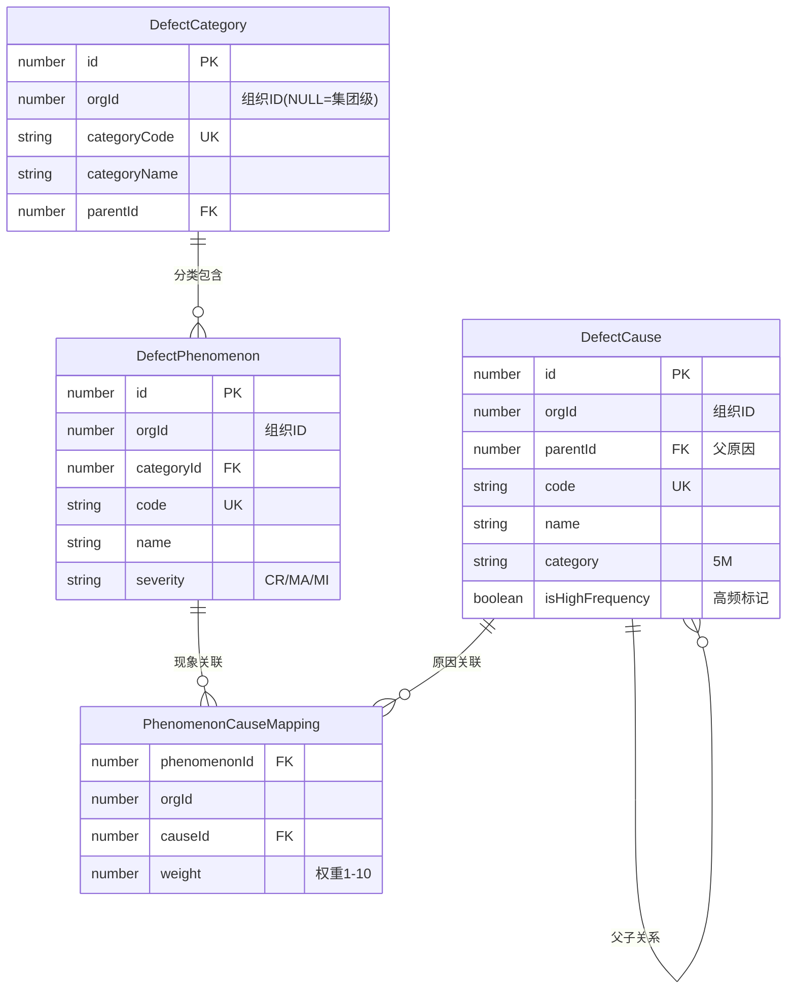

# 技术设计文档

## 1. 架构设计

### 1.1 整体架构

```
┌─────────────────────────────────────────────────────────┐
│                    前端 Vue 3 应用                        │
├─────────────────────────────────────────────────────────┤
│  不良现象管理    │   不良原因管理   │   知识库管理      │
│  - 组织选择      │   - 原因树       │   - 权重管理      │
│  - 现象列表      │   - 高频标记     │   - 关联推荐      │
└──────────┬──────────────┬──────────────┬───────────────┘
           │              │              │
           ▼              ▼              ▼
    ┌──────────────────────────────────────┐
    │        API 服务层 (Mock/Real)         │
    │  - defectManagement.ts               │
    │  - 数据过滤（多组织）                  │
    │  - 树形结构构建                        │
    └──────────┬───────────────────────────┘
               │
               ▼
    ┌──────────────────────────────────────┐
    │            数据库层                    │
    │  - QM_MD_DefectCategory              │
    │  - QM_MD_DefectPhenomenon            │
    │  - QM_MD_DefectCause                 │
    │  - QM_MD_PhenomenonCauseMapping      │
    └──────────────────────────────────────┘
```

### 1.2 数据流

#### 多组织数据过滤流程

```
用户登录 → 获取 orgId → 查询数据
                          ↓
                   过滤逻辑：
                   WHERE orgId IS NULL  (集团级)
                   OR orgId = :userOrgId (本工厂)
                          ↓
                   返回合并数据
```

#### 原因树构建流程

```
查询所有原因 → buildTree() 函数
                    ↓
              递归构建树形结构
              - 找出所有根节点 (parentId = NULL)
              - 为每个节点查找子节点
              - 递归处理子节点
                    ↓
              返回树形数据
```

## 2. 数据模型设计

### 2.1 核心实体关系



### 2.2 字段详细设计

#### DefectCause 扩展字段

| 字段 | 类型 | 说明 | 默认值 | 示例 |
|------|------|------|--------|------|
| orgId | number? | 组织ID，NULL表示集团级 | NULL | 1 (合肥工厂) |
| parentId | number? | 父原因ID，NULL表示根原因 | NULL | 500 |
| isHighFrequency | boolean | 是否高频原因 | false | true |

#### PhenomenonCauseMapping 扩展字段

| 字段 | 类型 | 说明 | 默认值 | 示例 |
|------|------|------|--------|------|
| orgId | number | 组织ID | - | 1 |
| weight | number | 权重/发生频率 | 1 | 8 |

## 3. 核心算法设计

### 3.1 树形结构构建算法

```typescript
/**
 * 构建原因树
 * @param items 扁平化的原因列表
 * @param parentId 父节点ID，默认为null（根节点）
 * @returns 树形结构数据
 */
function buildTree(
  items: DefectCause[], 
  parentId: number | null = null
): DefectCause[] {
  return items
    .filter(item => item.parentId === parentId)
    .map(item => ({
      ...item,
      children: buildTree(items, item.id)
    }))
    .sort((a, b) => {
      // 高频原因优先
      if (a.isHighFrequency && !b.isHighFrequency) return -1
      if (!a.isHighFrequency && b.isHighFrequency) return 1
      // 按名称排序
      return a.name.localeCompare(b.name)
    })
}
```

**时间复杂度**: O(n²)（可优化为 O(n) 使用 Map）

**优化版本**:

```typescript
function buildTreeOptimized(items: DefectCause[]): DefectCause[] {
  // 1. 创建 ID 映射
  const map = new Map<number, DefectCause>()
  items.forEach(item => {
    map.set(item.id, { ...item, children: [] })
  })
  
  // 2. 构建树形关系
  const roots: DefectCause[] = []
  map.forEach(item => {
    if (item.parentId === null) {
      roots.push(item)
    } else {
      const parent = map.get(item.parentId)
      if (parent) {
        parent.children!.push(item)
      }
    }
  })
  
  // 3. 排序
  const sortTree = (nodes: DefectCause[]) => {
    nodes.sort((a, b) => {
      if (a.isHighFrequency && !b.isHighFrequency) return -1
      if (!a.isHighFrequency && b.isHighFrequency) return 1
      return a.name.localeCompare(b.name)
    })
    nodes.forEach(node => {
      if (node.children && node.children.length > 0) {
        sortTree(node.children)
      }
    })
  }
  sortTree(roots)
  
  return roots
}
```

**时间复杂度**: O(n log n)

### 3.2 多组织数据过滤算法

```typescript
/**
 * 过滤多组织数据
 * @param items 所有数据
 * @param userOrgId 用户所属组织ID
 * @returns 过滤后的数据（集团级 + 本工厂）
 */
function filterByOrg<T extends { orgId?: number }>(
  items: T[], 
  userOrgId: number
): T[] {
  return items.filter(item => 
    item.orgId === null ||  // 集团级数据
    item.orgId === userOrgId  // 本工厂数据
  )
}
```

### 3.3 高频原因推荐算法

```typescript
/**
 * 获取推荐原因（按高频和权重排序）
 * @param phenomenonId 不良现象ID
 * @param allCauses 所有原因
 * @param mappings 现象-原因关联
 * @returns 推荐原因列表
 */
function getRecommendedCauses(
  phenomenonId: number,
  allCauses: DefectCause[],
  mappings: PhenomenonCauseMapping[]
): DefectCause[] {
  // 1. 获取该现象的历史关联
  const relatedMappings = mappings.filter(
    m => m.phenomenonId === phenomenonId
  )
  
  // 2. 计算评分
  const scores = new Map<number, number>()
  
  allCauses.forEach(cause => {
    let score = 0
    
    // 高频原因加分
    if (cause.isHighFrequency) {
      score += 50
    }
    
    // 历史关联权重加分
    const mapping = relatedMappings.find(m => m.causeId === cause.id)
    if (mapping) {
      score += mapping.weight * 10
    }
    
    scores.set(cause.id, score)
  })
  
  // 3. 排序
  return allCauses
    .filter(c => scores.get(c.id)! > 0)
    .sort((a, b) => scores.get(b.id)! - scores.get(a.id)!)
    .slice(0, 10)  // 取前10个
}
```

## 4. 前端组件设计

### 4.1 组件层级结构

```
DefectCauseList.vue (不良原因列表页)
├── 左侧面板
│   ├── 组织选择器 (OrgSelector)
│   └── 原因树 (a-tree)
│       └── 树节点 (自定义 title)
│           ├── 高频图标 (StarFilled)
│           └── 操作按钮 (添加子/编辑/删除)
└── 右侧面板
    ├── 搜索表单
    ├── 操作按钮
    └── 数据表格
        └── 高频标记列

DefectCauseEdit.vue (不良原因编辑页)
├── 基本信息 Tab
│   ├── 组织选择器
│   ├── 父原因选择器 (a-tree-select)
│   ├── 原因代码/名称
│   ├── 原因类别 (5M)
│   └── 高频开关 (a-switch)
└── 关联现象 Tab
```

### 4.2 关键组件实现

#### 原因树节点组件

```vue
<template #title="{ name, data }">
  <div class="tree-node-content">
    <span class="node-title">
      <!-- 高频标记 -->
      <StarFilled v-if="data.isHighFrequency" class="high-freq-icon" />
      <!-- 组织标识 -->
      <a-tag v-if="data.orgId" size="small" color="blue">
        {{ getOrgName(data.orgId) }}
      </a-tag>
      {{ name }}
    </span>
    <div class="node-actions">
      <PlusOutlined @click.stop="handleAddSubCause(data)" title="添加子原因" />
      <EditOutlined @click.stop="handleEdit(data)" />
      <DeleteOutlined @click.stop="handleDelete(data)" />
    </div>
  </div>
</template>
```

## 5. 数据库设计

### 5.1 表结构变更

```sql
-- 1. 缺陷分类表
ALTER TABLE QM_MD_DefectCategory 
ADD COLUMN orgId BIGINT NULL COMMENT '组织ID，NULL表示集团级';

-- 2. 不良现象表
ALTER TABLE QM_MD_DefectPhenomenon 
ADD COLUMN orgId BIGINT NULL COMMENT '组织ID';

-- 3. 不良原因表
ALTER TABLE QM_MD_DefectCause 
ADD COLUMN orgId BIGINT NULL COMMENT '组织ID',
ADD COLUMN parentId BIGINT NULL COMMENT '父原因ID',
ADD COLUMN isHighFrequency BOOLEAN DEFAULT FALSE COMMENT '是否高频原因';

-- 4. 现象-原因关联表
ALTER TABLE QM_MD_PhenomenonCauseKnowledgeMapping 
ADD COLUMN orgId BIGINT NOT NULL DEFAULT 1 COMMENT '组织ID',
ADD COLUMN weight INTEGER DEFAULT 1 COMMENT '权重/发生频率';
```

### 5.2 索引优化

```sql
-- 1. 组织过滤索引
CREATE INDEX idx_category_org ON QM_MD_DefectCategory(orgId);
CREATE INDEX idx_phenomenon_org ON QM_MD_DefectPhenomenon(orgId);
CREATE INDEX idx_cause_org ON QM_MD_DefectCause(orgId);

-- 2. 树查询索引
CREATE INDEX idx_cause_parent ON QM_MD_DefectCause(parentId);

-- 3. 高频查询索引
CREATE INDEX idx_cause_high_freq ON QM_MD_DefectCause(isHighFrequency);

-- 4. 组合索引（常用查询）
CREATE INDEX idx_cause_org_parent ON QM_MD_DefectCause(orgId, parentId);
```

### 5.3 约束变更

```sql
-- 1. 删除旧约束
ALTER TABLE QM_MD_DefectCategory DROP CONSTRAINT uk_category_code;
ALTER TABLE QM_MD_DefectPhenomenon DROP CONSTRAINT uk_phenomenon_code;
ALTER TABLE QM_MD_DefectCause DROP CONSTRAINT uk_cause_code;

-- 2. 添加新约束
ALTER TABLE QM_MD_DefectCategory 
ADD CONSTRAINT uk_org_category_code UNIQUE (orgId, categoryCode);

ALTER TABLE QM_MD_DefectPhenomenon 
ADD CONSTRAINT uk_org_phenomenon_code UNIQUE (orgId, code);

ALTER TABLE QM_MD_DefectCause 
ADD CONSTRAINT uk_org_cause_code UNIQUE (orgId, code);

-- 3. 外键约束
ALTER TABLE QM_MD_DefectCause 
ADD CONSTRAINT fk_cause_parent 
FOREIGN KEY (parentId) REFERENCES QM_MD_DefectCause(id) 
ON DELETE CASCADE;
```

## 6. 性能优化

### 6.1 前端优化

1. **树形数据缓存** - 使用 computed 缓存树形结构
2. **虚拟滚动** - 大数据量时使用虚拟列表
3. **懒加载** - 树节点按需加载子节点

### 6.2 后端优化

1. **查询优化** - 使用索引，避免全表扫描
2. **批量操作** - 批量插入/更新，减少数据库交互
3. **缓存策略** - 缓存常用数据（集团级数据）

## 7. 安全性考虑

### 7.1 数据隔离

- 用户只能查看本组织和集团级数据
- 用户只能修改本组织数据
- 集团级数据需要特殊权限才能修改

### 7.2 权限控制

```typescript
// 权限检查
function canEdit(item: DefectCause, user: User): boolean {
  // 集团级数据需要管理员权限
  if (item.orgId === null) {
    return user.hasRole('ADMIN')
  }
  // 工厂级数据需要同组织
  return item.orgId === user.orgId
}
```

## 8. 测试策略

### 8.1 单元测试

- 树形结构构建算法测试
- 多组织过滤逻辑测试
- 高频推荐算法测试

### 8.2 集成测试

- API 接口测试
- 数据库操作测试
- 权限控制测试

### 8.3 E2E 测试

- 完整业务流程测试
- 多组织场景测试
- 边界情况测试

## 9. 部署和迁移

### 9.1 数据迁移步骤

1. **备份数据** - 迁移前完整备份
2. **执行 DDL** - 添加字段和约束
3. **数据初始化** - 设置默认值
4. **验证数据** - 检查数据完整性
5. **回滚准备** - 准备回滚脚本

### 9.2 灰度发布

1. **阶段一** - 仅开放给测试用户
2. **阶段二** - 开放给部分工厂
3. **阶段三** - 全量发布

## 10. 监控和日志

### 10.1 关键指标

- 树形查询响应时间
- 高频推荐准确率
- 数据过滤性能

### 10.2 日志记录

- 数据修改日志（审计）
- 错误日志（异常处理）
- 性能日志（慢查询）
