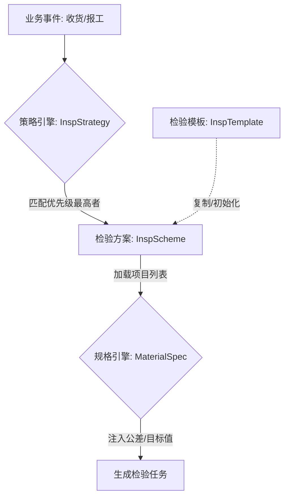

# Design: 检验模板与方案核心模型设计

## 1. 模型架构

遵循 `insp_main_data_req.md` 的三层数据模型，但对 L3 层进行拆分以支持“方案内容”与“方案策略”的解耦：

- **L1 基础标准库**：静态字典（项目、方法、量具、抽样规则、不良现象）。
- **L2 检验规划层 (Templates)**：
    - **InspTemplate**：标准化蓝图。
- **L3 规格与策略层 (Execution & Strategy)**：
    - **InspScheme (检验方案)**：**[新]** 具体的检验指令集。可基于模板创建，也可独立编辑。包含具体要查的项目列表。
    - **InspStrategy (检验策略)**：**[重构]** 路由规则。将业务上下文（供应商、物料）映射到某个 `InspScheme`。
    - **MaterialSpec (物料规格)**：**[增强]** 数值定义。定义特定物料在特定项目上的公差标准。

### 核心数据交互


## 2. 详细模型定义

### 2.1 检验方案 (QM_CFG_InspScheme) **[新]**
定义“怎么查”。它是模板的实例化，或者独立创建的方案。

| 字段 | 类型 | 说明 |
| --- | --- | --- |
| id | Long | PK |
| schemeCode | String | 方案编码 |
| schemeName | String | 方案名称 |
| version | String | 版本号 |
| status | Enum | DRAFT, APPROVED, OBSOLETE |
| sourceTemplateId | Long | 源模板ID (可选，用于追溯) |
| orgId | Long | 组织ID |

### 2.2 检验方案明细 (QM_CFG_InspSchemeDetail) **[新]**
方案的具体项目行。**可独立于模板进行增删改**。

| 字段 | 类型 | 说明 |
| --- | --- | --- |
| schemeId | Long | FK -> InspScheme |
| itemId | Long | FK -> InspItem (引用基础库项目) |
| sortOrder | Integer | 排序 |
| samplingRuleId | Long | 抽样规则 (可覆盖模板配置) |
| inspMethodId | Long | 检验方法 |
| isSpc | Boolean | 是否SPC |
| characteristicClass | String | 特性分类 (Critical/Major/Minor) |

### 2.3 检验策略 (QM_CFG_InspStrategy) **[原 InspPlan]**
定义“什么时候用哪个方案”。支持 1 个方案对应 N 个策略。

| 字段 | 类型 | 说明 |
| --- | --- | --- |
| schemeId | Long | FK -> InspScheme (绑定的方案) |
| contextType | Enum | IQC, IPQC, FQC, OQC |
| matchDimension | JSON | 匹配维度对象 (替代扁平字段，更灵活) |
| priority | Integer | 优先级 (越小越高) |
| triggerCondition | Enum | ALWAYS, NEW_SUPPLIER_BATCH, ECN_BATCH |
| triggerValue | Integer | 触发阈值 (如前3批) |

**matchDimension 示例**:
```json
{
  "materialId": "M007",
  "supplierId": "S01",
  "operationNo": "OP10"
}
```

### 2.4 物料检验规格 (QM_MD_MaterialSpec) **[增强]**
定义“标准是多少”。

| 字段 | 类型 | 说明 |
| --- | --- | --- |
| materialId | String | 物料 ID |
| inspItemCode | String | 关联检验项目 Code (通过 Code 关联，解耦 Scheme ID) |
| targetValue | Decimal | 目标值 |
| upperLimit | Decimal | USL |
| lowerLimit | Decimal | LSL |
| expectedValue | String | 期望值 |

## 3. 业务流程逻辑

### 3.1 创建方案
1. 用户在“检验方案管理”页面点击“新建”。
2. 选择“引用模板：电子料通用模板”。
3. 系统后端复制 `InspTemplateDetail` -> `InspSchemeDetail`。
4. 用户在界面上看到项目列表，点击“添加行”，增加“特殊外观检查”。
5. 保存为 `InspScheme` (id=101)。

### 3.2 绑定策略
1. 用户在“检验方案管理” -> “绑定策略”页签。
2. 新增策略：
   - 范围：物料 M001 + 供应商 S01。
   - 方案：选择 id=101 的方案。
   - 优先级：10。
3. 新增策略：
   - 范围：物料 M002 (同一类产品)。
   - 方案：选择 id=101 的方案。
   - 优先级：50。

### 3.3 执行匹配
1. 收货事件：物料 M001, 供应商 S01。
2. 引擎查找 `InspStrategy`：
   - 命中策略 1 (M001+S01)，优先级 10。
   - 命中策略 2 (M001+Context无)，优先级低。
3. 选定方案 id=101。
4. 加载方案明细。
5. 加载 M001 的 MaterialSpecs。
6. 合并生成任务。

## 4. UI 优化建议
- **方案与策略分离**：左侧列表展示“方案”，右侧 Tab 展示“方案内容”和“适用策略”。
- **差异化标识**：在方案编辑中，标出来自模板的行和新增的行。
- **模拟器**：在绑定页面提供“输入上下文 -> 输出方案”的实时测试。
