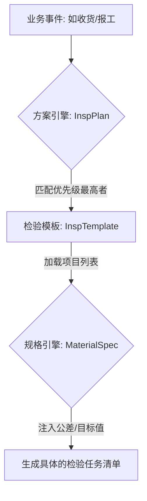

# Design: 检验模板与方案核心模型设计

## 1. 模型架构

遵循 `insp_main_data_req.md` 的三层数据模型，核心在于 L3 层的资源组装：

- **L1 基础标准库**：静态字典（项目、方法、量具、抽样规则、不良现象）。
- **L2 检验规划层 (Templates)**：业务蓝图（InspTemplate + InspTemplateDetail）。定义“检验过程流”。
- **L3 规格与策略层 (Spec & Strategy)**：
    - **物料检验规格 (MaterialSpec)**：数值层。定义特定物料在特定项目下的公差。
    - **检验方案策略 (InspPlan)**：路由层。定义上下文匹配逻辑与优先级。

### 核心数据交互

## 2. 详细模型定义

### 2.1 检验方案表 (QM_CFG_InspPlan)
| 字段 | 类型 | 说明 |
| --- | --- | --- |
| contextType | Enum | IQC, IPQC, FQC, OQC |
| materialId | String | 物料 ID |
| materialGroupId | String | 物料组 ID |
| supplierId | String | 供应商 ID (IQC 专用) |
| customerId | String | 客户 ID (OQC 专用) |
| operationNo | String | 工序号 (IPQC 专用) |
| ipqcType | Enum | FAI(首检), PATROL(巡检), LAI(末检) (IPQC 专用) |
| triggerCondition | Enum | ALWAYS, ON_NEW_SUPPLIER_N_BATCHES, ON_ECN_N_BATCHES |
| priority | Integer | 匹配优先级 (数值越小越优先) |

### 2.2 物料检验规格表 (QM_MD_MaterialSpec)
| 字段 | 类型 | 说明 |
| --- | --- | --- |
| materialId | String | 物料 ID |
| inspItemCode | String | 关联检验项目 Code |
| dataType | Enum | QUANTITATIVE (计量), QUALITATIVE (计数) |
| targetValue | Decimal | 目标值 (计量型) |
| upperLimit | Decimal | 上限 (USL) |
| lowerLimit | Decimal | 下限 (LSL) |
| standardText | String | 标准描述 (计数型) |
| expectedValue | String | 期望值 (如 OK/PASS) |

## 3. 优先级匹配逻辑增强

匹配引擎 `findBestPlan` 将根据输入上下文（Material, Supplier, Operation, contextType, ipqcType）计算分数。

**匹配得分规则（得分越高越优先，对应 priority 越小）：**
1. **物料 + 供应商 + 工序 + IPQC类型** (精确匹配)：1000分
2. **物料 + 供应商 (IQC常用)**：800分
3. **物料 + 工序 (IPQC常用)**：700分
4. **物料组 + 工序 (类通用)**：500分
5. **物料**：300分
6. **物料组**：200分
7. **组织/工厂通用**：100分

> [!IMPORTANT]
> 触发条件（如新供应商首 3 批）应赋予极高的优先级（或独立计算权重），以强制执行临时加严方案。

## 4. UI 优化建议
- **方案编辑页**：增加“匹配模拟器”侧边栏，输入参数即可预览将匹配到的模板及加载后的规格预览。
- **规格管理**：支持从 Excel 批量导入物料规格（SIP 导入）。
